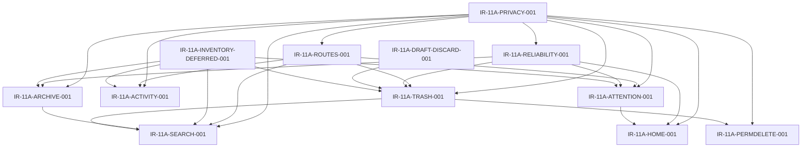

# Planner V1 M11 - 11A.1 R1 Global Surfaces Technical Readiness Audit Correction

Status: R1 corrected audit
Date: 2026-08-02
Lane: Planner V1 / M11 / 11A.1 R1
Branch: `planner-v1-11a-1-global-surfaces-technical-readiness`
Worktree: `C:\Users\thega\Desktop\HomePlus-worktrees\integration`
Correction base: `e245dd8a4c30177da1a9cb925e5d604758edf22e`
Original audit base: `e43f44ff218349b12b31e3f345f4998fc1e62d92`
Mode: documentation-only correction

## 1. Executive Summary

Verdict:

`PLANNER_GLOBAL_SURFACES_TECHNICAL_READINESS_READY_WITH_PRECONDITIONS`

R1 corrects the 11A.1 technical audit to align it with the approved P3 human decisions and P4 Product Freeze. The codebase has enough foundations to proceed through controlled implementation packages, but several foundations need adapters or contracts before the frozen surfaces can be released.

Corrected architecture:

- Global architecture is balanced, not a navigation redesign.
- Home is a Global Surface and remains hybrid: orientation, priority, continuity, conditional Attention, Today / Next, current Inventory exception, offline/stale/partial error handling.
- Quick Actions is the global surface that contains the `Buscar en HomePlus...` bar plus the small creation actions.
- Search starts from the bar inside Quick Actions and then opens full-screen.
- Search initial normal scope is active Tasks, Events, and Plans only.
- AppTopBar is reserved for the global Attention access and unresolved badge.
- Attention and Activity share one full-screen surface with tabs.
- Activity has no badge, no unread state, and no inline mutations.
- Trash is global and reachable from More plus local prefiltered entries.
- Archive is contextual by module. There is no single global Archive screen.
- Draft discard is definitive after confirmation when meaningful content exists.
- Inventory is protected by explicit deferral guards outside the current Home exception.
- Geni remains future-only and must not appear as a placeholder.

Main readiness conclusion:

- Quick Action creation is canonical.
- Quick Actions lacks the frozen Search bar adapter.
- Productive Search requires a contract, but active Search can proceed before archived and Trash contexts.
- Attention requires an item/count/resolution contract and AppTopBar wiring.
- Activity has backend logging foundations but needs the frozen tab/timeline contract.
- Global Trash has an aggregation foundation, but entity coverage, retention copy, local prefilters, restore semantics, and destructive operations need alignment.
- Draft recoverable trash/restore behavior is incompatible with the frozen discard rule and must be corrected before Global Trash release.
- Archive requires contextual entity work for Tasks, Events, Plans, and Presets; Inventory archive is deferred.
- Permanent delete and Empty Trash require coordinator-only, online-only destructive handling inside Papelera.

No implementation is started by this audit. All Integration Requests below are proposed and require Control General approval.

## 2. R1 Scope

This R1 correction modifies only this audit document.

Included:

- Correct interpretations, classifications, dependencies, Integration Requests, and sequencing.
- Preserve technical evidence already gathered where still valid.
- Reclassify requirements with the R1 taxonomy.
- Mark technical options as `PROPOSED - NOT FROZEN`.

Excluded:

- Product Freeze changes.
- Functional Freeze changes.
- Decision Registry changes.
- UX/UI Freeze Contract changes.
- Frontend code changes.
- Backend code changes.
- Tests.
- Routes.
- Migrations.
- Package or lock files.
- Supabase runtime access.
- Remote Git operations.

## 3. Preflight And Authority

Preflight for R1:

- `git rev-parse 'e245dd8^{commit}'`: resolved to `e245dd8a4c30177da1a9cb925e5d604758edf22e`.
- Branch: `planner-v1-11a-1-global-surfaces-technical-readiness`.
- HEAD at start: `e245dd8a4c30177da1a9cb925e5d604758edf22e`.
- Worktree at start: clean.
- Merge, rebase, cherry-pick, and bisect state: none detected.

Authority documents reread before this correction:

- `docs/implementation/planner/PLANNER_V1_M11_FUNCTIONAL_FREEZE.md`
- `docs/implementation/planner/PLANNER_V1_M11_FINAL_DECISION_REGISTRY.md`
- `docs/implementation/planner/PLANNER_V1_M11_UX_UI_FREEZE_CONTRACT.md`
- `docs/implementation/planner/M11_11A_P4_GLOBAL_SURFACES_PRODUCT_FREEZE.md`

Precedence applied:

1. Functional Freeze version 1.3.
2. Final Decision Registry.
3. UX/UI Freeze Contract.
4. P4 Global Surfaces Product Freeze.
5. This technical audit.

## 4. Corrected Product Invariants

The audit must not reopen or reinterpret these decisions.

### 4.1 Global Architecture

- Bottom Navigation remains structurally stable.
- Home remains a Global Surface.
- Quick Actions remains a Global Surface.
- Search lives as the bar inside Quick Actions, then transitions to full-screen.
- Attention and Activity share one tabbed full-screen surface.
- Trash is global.
- Archive is contextual by module.
- Planner keeps canonical Details, forms, lists, and Calendar.
- Global Surfaces project existing entities and do not duplicate canonical Details or forms.
- Inventory participates only where expressly approved.
- Geni does not appear until implemented.

### 4.2 Home

Home is hybrid. It orients, prioritizes, and gives continuity.

Home includes:

- Active household context.
- Conditional Attention excerpt when real unresolved items exist.
- Today / Next.
- Useful Planner continuity.
- Current Inventory exception.
- Offline, stale, and partial error states.

Home excludes:

- Permanent Search.
- Module gateway grid.
- Redundant access to Planner, Inventory, People, or More.
- Activity.
- Trash.
- Archive.
- Decorative metrics.
- Full Planner or Inventory lists.
- Full forms.
- Duplicate Details.

The backend-authored Planner Summary can be preserved when compatible. The technical work is adaptation, not removal from Global Surfaces.

### 4.3 Quick Actions And Search

Quick Actions is the surface. It contains:

- The `Buscar en HomePlus...` bar.
- Small creation actions for `Crear tarea`, `Crear evento`, and `Crear plan`.

The existing creation actions are a foundation, but the frozen Search bar is not present in the current menu.

Search behavior:

- Starts from the bar inside Quick Actions.
- Opens full-screen.
- Closes or transitions the Quick Actions sheet.
- Moves focus to full-screen Search.
- Restores focus and context on Back.
- Opens canonical destinations.
- Does not create parallel Details.
- Does not execute mutations.
- Does not replace Geni.

Initial normal Search scope:

- Active Tasks.
- Active Events.
- Active Plans.

Initial normal Search excludes:

- Presets.
- Drafts.
- Inventory Items.
- People.
- Settings.
- Routes.
- Commands.
- Actions.

Search contexts:

- Activos: initial normal context.
- Archivados: staged after contextual Archive work.
- Papelera: staged after Global Trash work.

Active Search must not be blocked by the first absence of Archive or Trash context implementation.

### 4.4 AppTopBar, Attention, And Activity

AppTopBar contains the global Attention access and unresolved badge. It does not contain Search.

Attention rules:

- Badge counts only unresolved visible items.
- Count belongs to the current person and active household.
- Reading, opening, or viewing an item does not resolve it.
- Each row can show one primary action plus `Abrir`.
- Complex flows open canonical Details or canonical flows.
- Inventory is not included initially.

Activity rules:

- Lives in the Activity tab beside Attention.
- Chronological timeline.
- Grouped by day, entity, and process where appropriate.
- No badge.
- No unread state.
- No novelty dots.
- No "mark all read".
- No inline mutations.
- Excludes navigation, clicks, searches, visited screens, keys, routine sync, technical logs, and Inventory initially.
- Shows human coordination events, not surveillance.

### 4.5 Trash, Drafts, Archive, And Destructive Operations

Global Trash:

- Lives in More as `Papelera`.
- Can be reached from local prefiltered entries.
- Covers Tasks, Events, Plans, and Presets where supported.
- Excludes Drafts.
- Keeps Inventory deferred.
- Shows 30-day retention, exact purge date, time remaining, entity type, source module, title, original date when relevant, who moved it, available action, and allowed scope.
- Restore depends on entity permission and is not coordinator-only.
- Move to Papelera depends on entity permission and is not coordinator-only.

Drafts:

- Draft is unconfirmed creation work.
- Draft is private to its creator while it exists.
- Drafts stay out of Home, Quick Actions, Search, Attention, Activity, Papelera, and Archive.
- `Descartar borrador` means immediate definitive deletion.
- Meaningful content discard requires confirmation.
- No automatic assumption of data migration is made unless evidence proves it.

Archive:

- Contextual by module.
- Entities: Tasks, Events, Plans, Presets.
- Inventory Items are functionally approved but technically deferred.
- Archive does not equal Completed, Closed, Cancelled, or Trash.
- Archive preserves history and relationships.
- Archive removes the entity from active views.
- Unarchive and move to Papelera depend on permission.
- Permanent delete is not available directly from Archive.

Permanent delete and Empty Trash:

- Exist only inside Papelera.
- Coordinator-only.
- Online-only.
- Not queued.
- Require explicit confirmation.
- Do not show success before backend confirmation.
- Empty Trash is the only initial bulk operation and must tolerate partial failure.

## 5. Classification Model

Allowed classifications:

- `EXISTS_CANONICAL`: the existing implementation is canonical for the frozen behavior.
- `EXISTS_PARTIAL`: usable foundation exists, but frozen behavior needs additional adaptation.
- `ADAPTER_REQUIRED`: existing surfaces or services can be adapted without asserting a new product decision.
- `NEW_CONTRACT_REQUIRED`: behavior needs an approved implementation contract before build.
- `BACKEND_CAPABILITY_REQUIRED`: backend permission/capability work is required.
- `DATA_CHANGE_REQUIRED`: evidence shows persisted data or schema compatibility work is required.
- `RELIABILITY_INTEGRATION_REQUIRED`: operation must integrate with the productive mutation/offline contract.
- `SECURITY_OR_PERMISSION_GAP`: privacy, ownership, role, or household filtering is incomplete.
- `DEFERRED_BY_PRODUCT`: explicitly deferred by P3/P4.
- `BLOCKED`: cannot proceed until Control General resolves a dependency.

Every matrix row has one primary classification and optional secondary classifications.

## 6. Frozen Requirement Readiness Matrix

| Requirement | Frozen behavior | Current implementation | Evidence | Primary classification | Secondary classification | Frontend gap | Backend gap | Data gap | Permission gap | Reliability gap | Test gap | Dependency | Probable owner | Proposed IR | Initial recommendation |
| --- | --- | --- | --- | --- | --- | --- | --- | --- | --- | --- | --- | --- | --- | --- | --- |
| Quick Actions surface | One global Quick Actions surface contains Search bar plus creation actions | Center Add opens `PlannerSheetHost`; current menu renders creation actions | `front/mi-front-limpio/navigation/HomeTabNavigator.tsx:168`, `front/mi-front-limpio/components/planner/PlannerSheetHost.tsx:428`, `front/mi-front-limpio/components/planner/QuickActionsMenu.tsx:39` | EXISTS_PARTIAL | ADAPTER_REQUIRED | Add frozen Search bar and separation from creation grid | None known for creation | None | Existing capability gate for creation | Existing create flows mostly use productive runtime | Quick Actions tests need Search bar expectations | IR-11A-ROUTES-001 | Frontend | IR-11A-ROUTES-001 | Adapt current sheet, preserve creation actions |
| Search bar inside Quick Actions | `Buscar en HomePlus...` appears inside Quick Actions above creation actions | No Search bar in current Quick Actions menu | `front/mi-front-limpio/components/planner/QuickActionsMenu.tsx:39`, `front/mi-front-limpio/services/planner/plannerQuickActions.ts:88` | ADAPTER_REQUIRED | NEW_CONTRACT_REQUIRED | Add bar and full touch/focus behavior | Search contract absent | Search result projection undecided | Query visibility must be server-filtered | Search is read-only but needs offline/stale states | Tests absent | IR-11A-SEARCH-001 | Frontend + Backend | IR-11A-SEARCH-001 | Add bar as part of Quick Actions, not as another surface |
| Search full-screen transition | Tapping the bar opens full-screen Search; Quick Actions closes or transitions | PlannerSearch route exists but starts from Planner navigation, not the frozen Quick Actions path | `front/mi-front-limpio/screens/planner/PlannerSearchScreen.tsx:56`, `front/mi-front-limpio/navigation/plannerSearchNavigation.ts:40` | EXISTS_PARTIAL | ADAPTER_REQUIRED | Wire transition, Back, keyboard, focus restoration | Contract for contexts absent | None | Capability check currently simplified on screen | No mutation queue required | Transition tests incomplete | IR-11A-ROUTES-001 | Frontend | IR-11A-ROUTES-001 | Reuse route if compatible, correct origin and transition |
| Search active Tasks | Initial Search includes active Tasks | Placeholder screen does not query or render results | `front/mi-front-limpio/screens/planner/PlannerSearchScreen.tsx:1`, `backend/src/routes/planner.js:34` | NEW_CONTRACT_REQUIRED | SECURITY_OR_PERMISSION_GAP | Result UI absent | Search behavior absent | Task searchable fields and canonical target need definition | Task visibility must filter before ranking | Read-only; stale/error states needed | Productive Search tests absent | IR-11A-PRIVACY-001 | Backend + Frontend | IR-11A-SEARCH-001 | Implement active Tasks first with server-side filtering |
| Search active Events | Initial Search includes active Events | Placeholder screen does not query or render results | `front/mi-front-limpio/screens/planner/PlannerSearchScreen.tsx:1`, `backend/src/routes/planner.js:70` | NEW_CONTRACT_REQUIRED | SECURITY_OR_PERMISSION_GAP | Result UI absent | Event search behavior absent | Event searchable fields and date display need definition | Event visibility must filter before ranking | Read-only; stale/error states needed | Productive Search tests absent | IR-11A-PRIVACY-001 | Backend + Frontend | IR-11A-SEARCH-001 | Implement active Events in same active Search package |
| Search active Plans | Initial Search includes active Plans | Planner/goal services exist, but Search is placeholder | `front/mi-front-limpio/screens/planner/PlannerSearchScreen.tsx:1`, `backend/src/services/planner.plans.service.js:242` | NEW_CONTRACT_REQUIRED | SECURITY_OR_PERMISSION_GAP | Result UI absent | Plan search behavior absent | Plan vs Goal naming must map to canonical destination | Personal/household scope must filter before ranking | Read-only; stale/error states needed | Productive Search tests absent | IR-11A-PRIVACY-001 | Backend + Frontend | IR-11A-SEARCH-001 | Include Plans in active Search, not Presets |
| Search archived context | Archived context is explicit and staged after Archive | Archive is incomplete for Tasks/Events/Presets; Plan archive exists but capability-denied | `backend/src/services/planner.plans.service.js:140`, `backend/src/lib/plannerCapabilities.js:84`, `backend/src/lib/plannerCapabilities.js:125` | BLOCKED | ADAPTER_REQUIRED | Context tab/filter absent | Contextual archive incomplete | Archive data differs by entity | Archive permissions not enabled/defined | Archive mutations need productive path | Archived Search tests absent | IR-11A-ARCHIVE-001 | Backend + Frontend | IR-11A-SEARCH-001 | Stage after Archive; do not block active Search |
| Search Trash context | Papelera context is explicit and staged after Global Trash | Planner Trash list exists, no Search context behavior | `front/mi-front-limpio/screens/planner/PlannerTrashScreen.tsx:31`, `backend/src/services/planner.trash.service.js:202` | BLOCKED | ADAPTER_REQUIRED | Context UI absent | Trash result query/filter absent | Retention display contract incomplete | Trash visibility and destructive permissions incomplete | Restore is mixed direct/runtime | Search-in-Papelera tests absent | IR-11A-TRASH-001 | Backend + Frontend | IR-11A-SEARCH-001 | Stage after Global Trash |
| AppTopBar Attention entry | AppTopBar shows Attention access with unresolved badge | AppTopBar has extensibility slot; no Attention access mounted | `front/mi-front-limpio/components/ui/AppTopBar.tsx:10`, `front/mi-front-limpio/navigation/HomeTabNavigator.tsx:217` | ADAPTER_REQUIRED | NEW_CONTRACT_REQUIRED | Add Attention access and badge only | Count/list contract absent | Attention identity absent | Count must be current person and household filtered | Resolution may need productive path | Shell/badge tests absent | IR-11A-ATTENTION-001 | Frontend + Backend | IR-11A-ROUTES-001 | Use AppTopBar only for Attention/Activity access |
| Attention count | Badge counts unresolved visible items | No Attention count source found | `front/mi-front-limpio/components/ui/AppTopBar.tsx:56`, `front/mi-front-limpio/screens/home/HomePlannerSections.tsx:270` | NEW_CONTRACT_REQUIRED | SECURITY_OR_PERMISSION_GAP | Badge data source absent | Count behavior absent | Stable unresolved identity absent | Must filter before count | Count updates after resolution needed | Count privacy tests absent | IR-11A-PRIVACY-001 | Backend + Frontend | IR-11A-ATTENTION-001 | Define count from visible unresolved items only |
| Attention list | Shows items requiring human decision or intervention | Home card uses summary counts, not Attention items | `front/mi-front-limpio/screens/home/HomePlannerSections.tsx:270` | NEW_CONTRACT_REQUIRED | SECURITY_OR_PERMISSION_GAP | Full-screen tab list absent | Attention item behavior absent | Identity/dedupe/source fields absent | Person recipient rules absent | Main action may need productive path | Attention list tests absent | IR-11A-ATTENTION-001 | Backend + Frontend | IR-11A-ATTENTION-001 | Derive or materialize only after contract approval |
| Attention resolution | Reading/opening does not resolve; valid action resolves | No resolution flow found | `front/mi-front-limpio/screens/home/HomePlannerSections.tsx:270`, `front/mi-front-limpio/services/planner/reliability/productiveMutations.ts:49` | NEW_CONTRACT_REQUIRED | RELIABILITY_INTEGRATION_REQUIRED | Resolution UI absent | Resolution mapping absent | Resolution state absent | Action permissions per item absent | Must be idempotent or confirmed | Resolution tests absent | IR-11A-RELIABILITY-001 | Backend + Frontend | IR-11A-ATTENTION-001 | Map each item to canonical action or canonical Detail |
| Activity tab | Activity shares full-screen tabs with Attention | Backend activity list exists; no tab UI | `backend/src/controllers/planner.activity.controller.js:21`, `backend/src/services/planner.activity.service.js:159` | EXISTS_PARTIAL | NEW_CONTRACT_REQUIRED | Activity tab absent | Timeline contract incomplete | Grouping fields may need adaptation | Activity privacy filtering must be explicit | Read-only, no queue | Activity tab tests absent | IR-11A-ROUTES-001 | Backend + Frontend | IR-11A-ACTIVITY-001 | Reuse log foundation after grouping/privacy contract |
| Activity grouping | Group by day, entity, and process where appropriate | Activity service lists chronological rows | `backend/src/services/planner.activity.service.js:159` | ADAPTER_REQUIRED | SECURITY_OR_PERMISSION_GAP | Group rendering absent | Grouping semantics absent | Process correlation may need fields | Hide private titles/details | None | Grouping tests absent | IR-11A-PRIVACY-001 | Backend + Frontend | IR-11A-ACTIVITY-001 | Keep simple timeline, no unread model |
| Home Attention excerpt | Home shows conditional unresolved Attention excerpt with `Ver todo` | Home has legacy `Atencion requerida` based on summary counts | `front/mi-front-limpio/screens/home/HomePlannerSections.tsx:270` | ADAPTER_REQUIRED | NEW_CONTRACT_REQUIRED | Replace counts with real Attention excerpt | Attention source absent | Item priority/recency absent | Must match visible items | Main actions may need productive path | Home Attention tests absent | IR-11A-ATTENTION-001 | Frontend + Backend | IR-11A-HOME-001 | Adapt Home as hybrid Global Surface |
| Home Today / Next | Home orients with Today / Next and useful continuity | Home Planner sections show task/event/goal cards | `front/mi-front-limpio/screens/home/HomePlannerSections.tsx:347`, `front/mi-front-limpio/screens/home/HomePlannerSections.tsx:430` | EXISTS_PARTIAL | ADAPTER_REQUIRED | Naming/order may need freeze alignment | Summary already backend-authored | Existing summary projections available | Summary asserts planner view | Inline completion bypass exists | Home tests limited | IR-11A-HOME-001 | Frontend | IR-11A-HOME-001 | Preserve compatible summary foundations |
| Home continuity | Home gives useful Planner continuity, not full lists | Summary maxes tasks/events/goals and renders limited cards | `backend/src/services/planner.summary.service.js:10`, `front/mi-front-limpio/services/plannerSummary.ts:31` | EXISTS_CANONICAL | RELIABILITY_INTEGRATION_REQUIRED | Avoid redundant gateways | Summary endpoint exists | None known | Capability already asserted | One-tap completion needs runtime alignment | Smoke coverage only | IR-11A-RELIABILITY-001 | Frontend | IR-11A-HOME-001 | Keep backend-authored summary where compatible |
| Home Inventory exception | Current Inventory exception is allowed in Home only | Home renders Inventory urgency card | `front/mi-front-limpio/screens/home/HomePlannerSections.tsx:67`, `backend/src/routes/inventory.js:9` | EXISTS_CANONICAL | DEFERRED_BY_PRODUCT | Keep exception scoped to Home | No global expansion | None for 11A | Preserve Inventory local permissions | Existing Inventory flows unaffected | Exclusion tests needed | IR-11A-INVENTORY-DEFERRED-001 | Product + Frontend | IR-11A-HOME-001 | Preserve current exception, add guards elsewhere |
| Global Trash aggregation | Papelera covers Tasks, Events, Plans, Presets; Drafts excluded | Current Planner Trash aggregates Tasks/Events/Goals/Milestones | `backend/src/services/planner.trash.service.js:202`, `backend/src/routes/planner.presets-drafts.js:9` | EXISTS_PARTIAL | ADAPTER_REQUIRED | UI filters/entity labels incomplete | Presets absent; Plan naming inconsistent | Retention fields need display coverage | Entity visibility incomplete | Restore path mixed | Trash tests incomplete | IR-11A-PRIVACY-001 | Backend + Frontend | IR-11A-TRASH-001 | Complete aggregation without adding Drafts |
| Trash filters | Papelera has filters and local prefiltered access | UI filters only all/tasks/events/goals | `front/mi-front-limpio/screens/planner/PlannerTrashScreen.tsx:31` | ADAPTER_REQUIRED | NEW_CONTRACT_REQUIRED | Add frozen filters and prefilled local origins | Filter contract incomplete | None known | Filter results must be permission-filtered | None | Filter tests absent | IR-11A-ROUTES-001 | Frontend + Backend | IR-11A-TRASH-001 | Align labels to Tasks/Events/Plans/Presets |
| Local prefiltered Trash entries | Modules can open Papelera prefiltered | No local prefiltered global entries found | `front/mi-front-limpio/screens/planner/PlannerTrashScreen.tsx:31`, `front/mi-front-limpio/screens/MoreScreen.tsx:11` | ADAPTER_REQUIRED | SECURITY_OR_PERMISSION_GAP | Add local entry points where frozen | Support initial filter params | None known | Preserve entity permissions | Restore still must confirm | Route tests absent | IR-11A-ROUTES-001 | Frontend | IR-11A-TRASH-001 | Add after Global Trash route is stable |
| Restore | Restore depends on entity permission, not coordinator-only | Task/Event restore uses runtime; goal/milestone restore direct | `front/mi-front-limpio/screens/planner/PlannerTrashScreen.tsx:111`, `front/mi-front-limpio/services/planner/reliability/productiveMutations.ts:105` | EXISTS_PARTIAL | RELIABILITY_INTEGRATION_REQUIRED | Mixed restore execution | Backend restore endpoints exist per entity | Broken relation handling needs surfacing | Entity-level permission checks needed | Direct paths need alignment | Restore tests incomplete | IR-11A-RELIABILITY-001 | Backend + Frontend | IR-11A-TRASH-001 | Normalize restore confirmation and blockers |
| Draft definitive discard | Discard deletes immediately and definitively after confirmation when meaningful | Drafts support trash/restore and recoverable UI | `backend/src/routes/planner.presets-drafts.js:22`, `backend/src/services/planner.drafts.service.js:99`, `front/mi-front-limpio/components/planner/drafts/PlannerDraftsScreen.tsx:190` | NEW_CONTRACT_REQUIRED | DATA_CHANGE_REQUIRED | Replace recoverable UI | Retire or adapt trash/restore behavior | Persisted draft trash fields exist | Owner-only privacy must remain | Discard should not become Trash restore | Existing tests expect old behavior | IR-11A-DRAFT-DISCARD-001 | Product + Backend + Frontend | IR-11A-DRAFT-DISCARD-001 | Correct before Global Trash release |
| Task Archive | Contextual archive for Tasks | Capability key exists but disabled; route not found | `backend/src/lib/plannerCapabilities.js:107`, `backend/src/routes/planner.js:59` | NEW_CONTRACT_REQUIRED | BACKEND_CAPABILITY_REQUIRED | Contextual UI absent | Archive behavior absent | Archive field/equivalent not evidenced | Capability disabled | Archive runtime absent | Tests absent | IR-11A-ARCHIVE-001 | Backend + Frontend | IR-11A-ARCHIVE-001 | Implement contextual, not global |
| Event Archive | Contextual archive for Events | No event archive route found | `backend/src/routes/planner.js:70`, `backend/src/lib/plannerCapabilities.js:84` | NEW_CONTRACT_REQUIRED | BACKEND_CAPABILITY_REQUIRED | Contextual UI absent | Archive behavior absent | Archive field/equivalent not evidenced | Capability absent/disabled | Archive runtime absent | Tests absent | IR-11A-ARCHIVE-001 | Backend + Frontend | IR-11A-ARCHIVE-001 | Align with event lifecycle |
| Plan Archive | Contextual archive for Plans | Service and migration support archive/unarchive, but capability denied | `backend/src/services/planner.plans.service.js:140`, `backend/src/lib/plannerCapabilities.js:125`, `supabase/migrations/20260722040000_m11_3a_plan_graph_foundation.sql:49` | EXISTS_PARTIAL | BACKEND_CAPABILITY_REQUIRED | UI action may be hidden | Existing service path needs freeze alignment | `archived_at` exists | Capability denied all roles | Plan graph write path exists | Enabled-path tests absent | IR-11A-ARCHIVE-001 | Backend + Frontend | IR-11A-ARCHIVE-001 | Decide capability enablement in Archive package |
| Preset Archive | Contextual archive for Presets | Preset trash/restore exists; archive not found | `backend/src/routes/planner.presets-drafts.js:9`, `front/mi-front-limpio/services/planner/reliability/productiveAdapters.ts:236` | NEW_CONTRACT_REQUIRED | DATA_CHANGE_REQUIRED | Preset archive UI absent | Archive behavior absent | Preset archive storage undecided | Capability absent | Archive runtime absent | Tests absent | IR-11A-ARCHIVE-001 | Backend + Data + Frontend | IR-11A-ARCHIVE-001 | Define contextual Preset archive |
| Inventory Archive deferred | Inventory archive is functionally approved but technically deferred | Inventory has local delete/search, not Planner archive | `backend/src/routes/inventory.js:9`, `backend/src/services/inventory.service.js:378` | DEFERRED_BY_PRODUCT | SECURITY_OR_PERMISSION_GAP | Guard against accidental global inclusion | No 11A global work | None for 11A | Preserve local Inventory rules | None | Guard tests needed | IR-11A-INVENTORY-DEFERRED-001 | Product + QA | IR-11A-INVENTORY-DEFERRED-001 | Explicitly defer and protect Inventory |
| Permanent delete | Only inside Papelera, coordinator-only, online-only | Not implemented in Trash UI or service | `front/mi-front-limpio/screens/planner/PlannerTrashScreen.tsx:216`, `backend/src/services/planner.trash.service.js:202` | NEW_CONTRACT_REQUIRED | SECURITY_OR_PERMISSION_GAP | Destructive UI absent | Destructive behavior absent | Entity integrity/retention policy needed | Coordinator-only server enforcement needed | Must not enqueue | Destructive tests absent | IR-11A-TRASH-001 | Backend + Frontend | IR-11A-PERMDELETE-001 | Treat separately from move/restore |
| Empty Trash | Only inside Papelera, coordinator-only, online-only, partial failure aware | Not implemented | `front/mi-front-limpio/screens/planner/PlannerTrashScreen.tsx:216`, `backend/src/services/planner.trash.service.js:202` | NEW_CONTRACT_REQUIRED | SECURITY_OR_PERMISSION_GAP | Bulk confirmation UI absent | Bulk behavior absent | Partial failure semantics needed | Coordinator-only server enforcement needed | Must not enqueue | Bulk destructive tests absent | IR-11A-PERMDELETE-001 | Backend + Frontend | IR-11A-PERMDELETE-001 | Implement after Trash aggregation |
| Coordinator permission | Permanent delete and Empty Trash are coordinator-only | Capability model exists but destructive keys absent | `backend/src/lib/plannerCapabilities.js:13`, `backend/src/lib/plannerCapabilities.js:84` | BACKEND_CAPABILITY_REQUIRED | SECURITY_OR_PERMISSION_GAP | UI must hide/disable based on backend | Capability contract needed | None known | Server enforcement mandatory | Online-only behavior required | Permission tests absent | IR-11A-PRIVACY-001 | Backend | IR-11A-PERMDELETE-001 | Enforce server-side; frontend is presentation only |
| Entity move/restore permission | Move and restore use entity permission, not coordinator-only | Existing routes vary by entity; some restore direct | `front/mi-front-limpio/screens/planner/PlannerTrashScreen.tsx:111`, `backend/src/routes/planner.js:59` | EXISTS_PARTIAL | BACKEND_CAPABILITY_REQUIRED | UI needs per-entity actions | Permission consistency audit needed | None known | Entity-specific permissions required | Restore runtime alignment needed | Permission tests absent | IR-11A-PRIVACY-001 | Backend + Frontend | IR-11A-TRASH-001 | Do not over-restrict restore to coordinator |
| Privacy | Privacy applies before ranking/count/grouping/results | Summary and activity are household-scoped; gaps remain for personal visibility | `backend/src/services/planner.summary.service.js:61`, `backend/src/services/planner.summary.service.js:199`, `backend/src/services/planner.activity.service.js:159` | SECURITY_OR_PERMISSION_GAP | BACKEND_CAPABILITY_REQUIRED | UI must not infer hidden data | Server filters needed before all projections | Visibility model differs by entity | Household/person/ownership rules need shared handling | Household switch invalidation needed | Privacy tests absent | None | Backend + QA | IR-11A-PRIVACY-001 | Make this first shared foundation |
| Household switching | Surface context must invalidate on household/person changes | Summary hook reloads on household/person keys; global surfaces not implemented | `front/mi-front-limpio/services/planner/useHomePlannerSummary.ts:270`, `front/mi-front-limpio/components/planner/PlannerSheetHost.tsx:428` | EXISTS_PARTIAL | SECURITY_OR_PERMISSION_GAP | Global surfaces need invalidation rules | Responses must be scoped server-side | None known | Current person/household must match response | Pending mutation scopes must isolate | Household-switch tests incomplete | IR-11A-PRIVACY-001 | Frontend + Backend | IR-11A-ROUTES-001 | Reuse summary/runtime patterns |
| Reliability | Mutations require canonical confirmation; destructive permanent ops online-only | Productive runtime exists; Home complete and some restore paths bypass it | `front/mi-front-limpio/services/planner/reliability/productiveMutations.ts:49`, `front/mi-front-limpio/screens/home/HomePlannerSections.tsx:203`, `front/mi-front-limpio/screens/planner/PlannerTrashScreen.tsx:111` | RELIABILITY_INTEGRATION_REQUIRED | EXISTS_PARTIAL | Align inline and restore flows | Idempotency/confirmation varies | None known | Permission checks per mutation | Permanent delete must not queue | Global surface reliability tests absent | IR-11A-PRIVACY-001 | Frontend + Backend | IR-11A-RELIABILITY-001 | Normalize reversible mutations; keep hard delete online-only |
| Geni future process | Geni appears only when implemented and identified | No Geni action in Quick Actions catalog | `front/mi-front-limpio/services/planner/plannerQuickActions.ts:88` | DEFERRED_BY_PRODUCT | EXISTS_CANONICAL | Preserve absence | None | None | Future identity rules needed | Future process correlation only | Guard tests useful | None | Product | IR-11A-INVENTORY-DEFERRED-001 | Keep absent; no placeholder |

## 7. Surface Readiness

### 7.1 Quick Actions

Current creation actions are a valid foundation. The R1 correction is that Quick Actions is not creation-only: it must also contain the Search bar.

Current foundations:

- The center tab opens `PlannerSheetHost`.
- `QuickActionsMenu` renders three implemented creation actions.
- The catalog excludes Templates, Drafts, Inventory, Trash, Archive, lifecycle actions, and module navigation.

Gap:

- The `Buscar en HomePlus...` bar is absent from the current Quick Actions menu.
- Full-screen Search transition from that bar is not wired.
- Focus restoration and Android Back behavior must be verified for the frozen path.

### 7.2 Search

Search is not a separate global entry. It starts from Quick Actions and then opens full-screen.

Current foundations:

- `PlannerSearchScreen` exists.
- Search navigation helpers exist.
- Capability/access helpers exist.

Gaps:

- Current screen is intentionally non-productive.
- No input/results/loading/empty/error result model is implemented.
- Initial active scope must be limited to Tasks, Events, and Plans.
- Presets are excluded from initial Search even though they participate in Archive/Papelera.
- Archived context depends on `IR-11A-ARCHIVE-001`.
- Papelera context depends on `IR-11A-TRASH-001`.

### 7.3 AppTopBar, Attention, Activity

AppTopBar has a technical extension point, but the frozen use for 11A is Attention access and badge.

Attention gaps:

- No count source.
- No item identity.
- No deduplication.
- No recipient/person targeting.
- No resolution mapping.
- No tabbed full-screen surface.
- Home currently shows only legacy summary-derived attention-like counts.

Activity foundations and gaps:

- Backend activity logging/listing exists.
- It is not yet the frozen Activity tab.
- Grouping by day/entity/process is absent.
- Privacy minimization and exclusion of technical noise require contract work.
- Activity must stay read-only, badge-free, and without unread semantics.

### 7.4 Home

Home is a Global Surface and should be adapted, not excluded.

Current foundations:

- Home Planner sections are backed by a single summary request.
- Summary service projects limited Tasks, Events, and Plan/Goal continuity.
- Home role variants mount `HomePlannerSections`.
- Inventory urgency is present as the current approved exception.

Gaps:

- Attention excerpt must use real unresolved Attention items when available.
- Home must keep Today / Next and useful continuity without becoming full Planner.
- Home must exclude Activity, Trash, Archive, permanent Search, and module gateways.
- One-tap completion should align with productive mutation Reliability.

### 7.5 Trash

Current Trash is a foundation, not the final global surface.

Current foundations:

- Backend aggregates trashed Tasks, Events, Goals, and Milestones.
- Frontend Trash screen exists.
- Restore exists for several entity types.

Gaps:

- More does not expose `Papelera`.
- Presets are absent from the aggregate despite preset trash/restore support.
- Plans/Goals naming needs user-facing alignment.
- Drafts must remain excluded while Draft discard is corrected separately.
- Retention copy, exact purge date, time remaining, local prefilters, and permissions need alignment.
- Permanent delete and Empty Trash are separate destructive work under `IR-11A-PERMDELETE-001`.

### 7.6 Archive

Archive is contextual by module.

Current foundations:

- Plan graph service has archive/unarchive mechanics.
- Plan migration includes `archived_at`.

Gaps:

- Plan archive capability is disabled.
- Task archive behavior is absent.
- Event archive behavior is absent.
- Preset archive behavior is absent.
- Inventory archive is deferred.
- Archived Search should follow contextual Archive work.

### 7.7 Drafts

Draft behavior requires correction before Global Trash release.

Current evidence:

- Draft routes support trash and restore.
- Draft service stores recoverable trash fields.
- Draft UI shows active and trashed partitions.
- Existing tests encode recoverable draft behavior.

Frozen correction:

- Draft discard is definitive after confirmation when meaningful.
- Drafts do not appear in Papelera.
- Do not assume data migration unless persistent compatibility evidence requires it.

## 8. Integration Requests

All IRs below are:

`PROPOSED - REQUIRES CONTROL GENERAL APPROVAL`

### IR-11A-ROUTES-001

Problem: current routes and navigation paths do not fully match frozen surface ownership and transitions.

Frozen decision:

- Quick Actions contains Search bar plus creation actions.
- Search full-screen starts from Quick Actions.
- Attention/Activity are reached from AppTopBar.
- Trash is reached from More and local prefiltered entries.
- Archive is contextual.

Evidence:

- `front/mi-front-limpio/navigation/HomeTabNavigator.tsx:168`
- `front/mi-front-limpio/navigation/HomeTabNavigator.tsx:217`
- `front/mi-front-limpio/screens/MoreScreen.tsx:11`
- `front/mi-front-limpio/navigation/plannerSearchNavigation.ts:40`

Classification:

- Primary: `ADAPTER_REQUIRED`
- Secondary: `SECURITY_OR_PERMISSION_GAP`

Ownership probable: Frontend, with backend support for route/context contracts.

Dependencies:

- `IR-11A-PRIVACY-001`

Minimum scope:

- Quick Actions entry and Search bar origin.
- Full-screen Search transition, Back, keyboard, focus restoration.
- Attention/Activity access from AppTopBar.
- Global Trash from More.
- Local prefiltered Trash entries.
- Contextual Archive entry handling.
- Archived and recovery contexts.

Exclusions:

- Bottom Navigation redesign.
- Independent Search access outside Quick Actions.
- Global Archive screen.

Risks:

- Duplicate navigation paths.
- Focus loss on Back.
- Context leakage after household switch.

Acceptance evidence:

- Navigation tests for phone/tablet, Back, focus restoration, and household switching.
- Audit that Quick Actions remains the Search origin.

Suggested order: Package A foundation.

### IR-11A-PRIVACY-001

Problem: global surfaces need shared privacy, permission, role, household, ownership, and personal-scope rules before ranking/counting/grouping/results.

Frozen decision:

- Privacy applies before Search ranking, Attention count, Activity grouping, Trash listing, and Archive exposure.
- Coordinator does not automatically see private personal content.
- Frontend visibility does not replace backend authorization.

Evidence:

- `backend/src/lib/plannerCapabilities.js:13`
- `backend/src/services/planner.summary.service.js:61`
- `backend/src/services/planner.summary.service.js:199`
- `backend/src/services/planner.activity.service.js:159`

Classification:

- Primary: `SECURITY_OR_PERMISSION_GAP`
- Secondary: `BACKEND_CAPABILITY_REQUIRED`

Ownership probable: Backend + QA.

Dependencies: none.

Minimum scope:

- Current user.
- Active household.
- Ownership.
- Personal and household scope.
- Entity permissions.
- Filtering before ranking/counting/grouping.
- Household switch, late responses, logout/login.

Exclusions:

- Freezing concrete capability names before implementation design.

Risks:

- Invisible item count leakage.
- Private titles in Activity.
- Unauthorized Trash enumeration.

Acceptance evidence:

- Role and household tests for Search, Attention, Activity, Trash, Archive.
- Count/list parity tests for Attention.

Suggested order: Package A foundation.

### IR-11A-RELIABILITY-001

Problem: reversible global-surface mutations and Home inline actions need canonical confirmation; permanent destructive operations must stay online-only and out of queue.

Frozen decision:

- Restore and contextual entity actions should not claim success until canonical confirmation.
- Permanent delete and Empty Trash do not work offline and are not queued.

Evidence:

- `front/mi-front-limpio/services/planner/reliability/productiveMutations.ts:49`
- `front/mi-front-limpio/screens/home/HomePlannerSections.tsx:203`
- `front/mi-front-limpio/screens/planner/PlannerTrashScreen.tsx:111`

Classification:

- Primary: `RELIABILITY_INTEGRATION_REQUIRED`
- Secondary: `EXISTS_PARTIAL`

Ownership probable: Frontend + Backend.

Dependencies:

- `IR-11A-PRIVACY-001`

Minimum scope:

- Home inline completion.
- Restore from Papelera.
- Archive/unarchive where applicable.
- Attention primary actions.
- Offline/stale/error states.
- Online-only guard for destructive permanent operations.

Exclusions:

- Queueing permanent delete.
- Queueing Empty Trash.

Risks:

- False success after failed restore.
- Duplicate actions after retry.
- Data loss if hard delete is treated as queued mutation.

Acceptance evidence:

- Runtime tests for restore/archive/Attention actions.
- Offline blocked tests for permanent destructive actions.

Suggested order: Package A foundation.

### IR-11A-DRAFT-DISCARD-001

Problem: current Drafts are recoverable via trash/restore, while the freeze says discard is immediate and definitive after confirmation for meaningful content.

Frozen decision:

- Drafts stay out of Home, Quick Actions, Search, Attention, Activity, Papelera, and Archive.
- Discarded Drafts do not restore.

Evidence:

- `backend/src/routes/planner.presets-drafts.js:22`
- `backend/src/services/planner.drafts.service.js:99`
- `backend/src/services/planner.drafts.service.js:110`
- `front/mi-front-limpio/components/planner/drafts/PlannerDraftsScreen.tsx:190`

Classification:

- Primary: `NEW_CONTRACT_REQUIRED`
- Secondary: `DATA_CHANGE_REQUIRED`

Ownership probable: Product + Backend + Frontend + QA.

Dependencies:

- `IR-11A-PRIVACY-001`

Minimum scope:

- Compatible retirement or adaptation of Draft trash/restore behavior.
- Confirmation for meaningful Draft discard.
- Definitive discard semantics.
- Owner-only privacy.
- Legacy route/test compatibility decision.

Exclusions:

- Adding Drafts to Papelera.
- Adding Drafts to Search.
- Assuming migration without evidence.

Risks:

- Loss of work if confirmation is weak.
- Old tests preserving obsolete behavior.
- Existing stored draft trash fields need compatibility handling.

Acceptance evidence:

- Tests proving Drafts are absent from global surfaces.
- Tests proving meaningful discard requires confirmation and cannot be restored in UI.

Suggested order: Package A foundation; must be complete before Global Trash release.

### IR-11A-INVENTORY-DEFERRED-001

Problem: Inventory has local capabilities that can be accidentally pulled into global Planner surfaces.

Frozen decision:

- Inventory remains excluded from Search, Attention, Activity, Quick Actions, Trash, and Archive for 11A, except the current Home exception.
- Inventory Archive is product-approved but technically deferred.

Evidence:

- `front/mi-front-limpio/screens/home/HomePlannerSections.tsx:67`
- `backend/src/routes/inventory.js:9`
- `backend/src/services/inventory.service.js:198`
- `backend/src/services/inventory.service.js:378`

Classification:

- Primary: `DEFERRED_BY_PRODUCT`
- Secondary: `SECURITY_OR_PERMISSION_GAP`

Ownership probable: Product + QA + Frontend + Backend.

Dependencies: transversal.

Minimum scope:

- Guard tests and explicit exclusions.
- Preserve Home Inventory exception.
- Preserve local Inventory behavior.

Exclusions:

- Inventory in Search.
- Inventory inside the Attention surface.
- Inventory inside the Activity surface.
- Inventory in Quick Actions.
- Inventory in Papelera.
- Inventory in Archive during 11A.

Risks:

- Generic aggregation accidentally exposes Inventory.
- Product scope creep.

Acceptance evidence:

- Exclusion tests across all global surfaces.

Suggested order: Package A foundation and carried through all packages.

### IR-11A-SEARCH-001

Problem: Search exists only as a placeholder and lacks the frozen Quick Actions origin and productive active results.

Frozen decision:

- Search starts from the bar inside Quick Actions.
- Full-screen Search opens canonical destinations.
- Initial normal Search includes active Tasks, Events, and Plans only.
- Archived and Papelera contexts are explicit staged contexts.

Evidence:

- `front/mi-front-limpio/screens/planner/PlannerSearchScreen.tsx:1`
- `front/mi-front-limpio/services/planner/plannerSearchStates.ts:10`
- `front/mi-front-limpio/navigation/plannerSearchNavigation.ts:40`
- `backend/src/routes/planner.js:34`

Classification:

- Primary: `NEW_CONTRACT_REQUIRED`
- Secondary: `SECURITY_OR_PERMISSION_GAP`

Ownership probable: Backend + Frontend.

Dependencies:

- Active context: `IR-11A-PRIVACY-001`, `IR-11A-ROUTES-001`
- Archived context: `IR-11A-ARCHIVE-001`
- Papelera context: `IR-11A-TRASH-001`

Minimum scope:

- Search bar inside Quick Actions.
- Full-screen Search.
- Active Tasks, Events, Plans.
- Permissions before ranking.
- Canonical destinations.
- Loading, empty, error, offline/stale states.
- Staged archived and Papelera contexts.

Exclusions:

- Presets in initial normal Search.
- Drafts.
- Inventory.
- People.
- Settings.
- Commands.
- Actions.
- Routes.

Risks:

- Search scope creep.
- Privacy leakage before filtering.
- Incorrect destination for archived or trashed results.

Acceptance evidence:

- Active Search tests for Tasks, Events, Plans only.
- Exclusion tests for Presets, Drafts, Inventory, People, Settings, commands, actions, and routes.
- Canonical destination tests.

Suggested order: Package B for active context; Package F for staged contexts.

### IR-11A-ATTENTION-001

Problem: Attention lacks shared surface, count, item identity, deduplication, recipient rules, and resolution semantics.

Frozen decision:

- Attention is accessed from AppTopBar and shares tabs with Activity.
- Badge counts unresolved visible Attention items only.
- Reading/opening does not resolve.
- Each row can expose one primary action plus `Abrir`.
- Home can show a conditional excerpt.
- Inventory is excluded initially.

Evidence:

- `front/mi-front-limpio/components/ui/AppTopBar.tsx:10`
- `front/mi-front-limpio/navigation/HomeTabNavigator.tsx:217`
- `front/mi-front-limpio/screens/home/HomePlannerSections.tsx:270`

Classification:

- Primary: `NEW_CONTRACT_REQUIRED`
- Secondary: `RELIABILITY_INTEGRATION_REQUIRED`

Ownership probable: Backend + Frontend.

Dependencies:

- `IR-11A-PRIVACY-001`
- `IR-11A-ROUTES-001`
- `IR-11A-RELIABILITY-001`

Minimum scope:

- AppTopBar Attention access.
- Count and badge.
- List.
- Item identity.
- Deduplication.
- Recipient/person targeting.
- Valid resolution.
- Home excerpt.

Exclusions:

- Inventory.
- Activity events.
- Technical logs.
- Read/unread model.

Risks:

- Badge/list mismatch.
- Noisy or non-actionable items.
- Invalid resolution removing items prematurely.

Acceptance evidence:

- Count equals visible unresolved list.
- Open/read leaves item unresolved.
- Valid action resolves or opens canonical flow.
- Home excerpt uses same source.

Suggested order: Package C.

### IR-11A-ACTIVITY-001

Problem: activity logging exists, but frozen Activity tab/timeline behavior is not implemented.

Frozen decision:

- Activity is a chronological timeline in the tab beside Attention.
- It has no badge, no unread, no inline mutations.
- It groups by day, entity, and process where appropriate.
- It excludes technical noise and Inventory initially.

Evidence:

- `backend/src/controllers/planner.activity.controller.js:21`
- `backend/src/services/planner.activity.service.js:147`
- `backend/src/services/planner.activity.service.js:159`

Classification:

- Primary: `EXISTS_PARTIAL`
- Secondary: `NEW_CONTRACT_REQUIRED`

Ownership probable: Backend + Frontend.

Dependencies:

- `IR-11A-PRIVACY-001`
- `IR-11A-ROUTES-001`

Minimum scope:

- Shared tab UI.
- Simple timeline.
- Grouping.
- Privacy minimization.
- Canonical open destination.
- Exclusion of technical noise.

Exclusions:

- Badge.
- Unread.
- Mark-all-read.
- Inline mutations.
- Inventory.

Risks:

- Activity becoming surveillance.
- Private data in payloads.

Acceptance evidence:

- Timeline grouping tests.
- Privacy tests.
- Tests proving no badge/unread affordance.

Suggested order: Package C.

### IR-11A-ARCHIVE-001

Problem: contextual Archive is only partially supported and must cover Tasks, Events, Plans, and Presets while keeping Inventory deferred.

Frozen decision:

- Archive is contextual by module.
- It is separate from completed/closed/cancelled/trash.
- It preserves history and relationships.
- It removes entities from active views.
- It allows unarchive according to permissions.
- No global Archive screen exists.

Evidence:

- `backend/src/services/planner.plans.service.js:140`
- `backend/src/lib/plannerCapabilities.js:84`
- `backend/src/lib/plannerCapabilities.js:107`
- `backend/src/lib/plannerCapabilities.js:125`
- `backend/src/routes/planner.js:59`
- `backend/src/routes/planner.presets-drafts.js:9`

Classification:

- Primary: `NEW_CONTRACT_REQUIRED`
- Secondary: `BACKEND_CAPABILITY_REQUIRED`

Ownership probable: Backend + Data + Frontend.

Dependencies:

- `IR-11A-PRIVACY-001`
- `IR-11A-RELIABILITY-001`
- `IR-11A-INVENTORY-DEFERRED-001`

Minimum scope:

- Task Archive.
- Event Archive.
- Plan Archive.
- Preset Archive.
- Contextual entry.
- Unarchive.
- Active list exclusion.
- Archived Search context.
- Permissions and Reliability.

Exclusions:

- Global Archive screen.
- Inventory Archive in 11A.

Risks:

- Misusing operational status as archive.
- Exposing archived content outside scope.

Acceptance evidence:

- Entity archive/unarchive tests.
- Active list exclusion tests.
- Archived Search context tests after archive exists.

Suggested order: Package D.

### IR-11A-TRASH-001

Problem: Global Trash exists only as a partial Planner Trash foundation and lacks frozen scope, filters, local prefilters, Presets, retention display, and full permission semantics.

Frozen decision:

- Papelera is global.
- More exposes Papelera.
- Local module entries can open prefiltered Papelera.
- It includes Tasks, Events, Plans, and Presets.
- Drafts are excluded.
- Inventory is deferred.
- Restore follows entity permissions.
- Permanent delete is handled by a separate IR.

Evidence:

- `backend/src/services/planner.trash.service.js:202`
- `front/mi-front-limpio/screens/planner/PlannerTrashScreen.tsx:31`
- `front/mi-front-limpio/screens/MoreScreen.tsx:11`
- `backend/src/routes/planner.presets-drafts.js:9`

Classification:

- Primary: `EXISTS_PARTIAL`
- Secondary: `ADAPTER_REQUIRED`

Ownership probable: Backend + Frontend.

Dependencies:

- `IR-11A-PRIVACY-001`
- `IR-11A-RELIABILITY-001`
- `IR-11A-DRAFT-DISCARD-001` before release
- `IR-11A-INVENTORY-DEFERRED-001`

Minimum scope:

- More -> Papelera.
- Filters.
- Local prefiltered entries.
- Tasks, Events, Plans, Presets.
- Draft exclusion.
- Inventory deferral.
- 30-day retention copy.
- Restore with entity permissions.
- Papelera Search context.

Exclusions:

- Permanent delete as part of the same contract.
- Drafts in Papelera.
- Inventory in Papelera for 11A.

Risks:

- Drafts leaking into Papelera through existing draft trash data.
- Restore over-restricted to coordinator.
- Retention copy not matching exact purge date.

Acceptance evidence:

- Entity coverage tests.
- Draft exclusion tests.
- Restore permission tests.
- Retention copy tests.

Suggested order: Package E.

### IR-11A-PERMDELETE-001

Problem: permanent delete and Empty Trash are frozen destructive operations but absent.

Frozen decision:

- Only inside Papelera.
- Coordinator-only.
- Online-only.
- Not queued.
- Explicit confirmation.
- Empty Trash is the only initial bulk operation and tolerates partial failure.

Evidence:

- `front/mi-front-limpio/screens/planner/PlannerTrashScreen.tsx:216`
- `backend/src/services/planner.trash.service.js:202`
- `backend/src/lib/plannerCapabilities.js:13`

Classification:

- Primary: `NEW_CONTRACT_REQUIRED`
- Secondary: `SECURITY_OR_PERMISSION_GAP`

Ownership probable: Backend + Frontend + QA.

Dependencies:

- `IR-11A-TRASH-001`
- `IR-11A-PRIVACY-001`

Minimum scope:

- Per-entity permanent delete.
- Empty Trash.
- Coordinator-only enforcement.
- Online-only guard.
- Confirmation copy.
- Integrity and relationship behavior.
- Partial failure behavior.
- Activity/audit when appropriate.

Exclusions:

- Draft discard through Papelera.
- Multiselect.
- Bulk restore.
- Bulk archive.
- Queued destructive permanent operations.

Risks:

- Data loss.
- Referential integrity breakage.
- False success while offline.

Acceptance evidence:

- Coordinator-only server tests.
- Offline blocked tests.
- Partial failure tests.
- Confirmation and no-optimistic-success tests.

Suggested order: Package G.

### IR-11A-HOME-001

Problem: Home needs adaptation to the hybrid Global Surface freeze, especially Attention excerpt and Reliability alignment.

Frozen decision:

- Home orients, prioritizes, and gives continuity.
- It contains conditional Attention, Today / Next, useful Planner continuity, current Inventory exception, offline/stale/partial error states.
- It excludes permanent Search, Activity, Trash, Archive, module gateway grids, full lists, full forms, and duplicate Details.
- Planner Summary may stay if compatible.

Evidence:

- `front/mi-front-limpio/screens/home/HomePlannerSections.tsx:67`
- `front/mi-front-limpio/screens/home/HomePlannerSections.tsx:203`
- `front/mi-front-limpio/screens/home/HomePlannerSections.tsx:270`
- `front/mi-front-limpio/services/plannerSummary.ts:31`
- `backend/src/services/planner.summary.service.js:10`

Classification:

- Primary: `ADAPTER_REQUIRED`
- Secondary: `RELIABILITY_INTEGRATION_REQUIRED`

Ownership probable: Frontend + Backend.

Dependencies:

- `IR-11A-ATTENTION-001`
- `IR-11A-RELIABILITY-001`
- `IR-11A-INVENTORY-DEFERRED-001`

Minimum scope:

- Conditional Attention excerpt.
- Importance and recency ordering.
- `Ver todo`.
- Today / Next.
- Useful Planner continuity.
- Current Inventory exception.
- Activity exclusion.
- Permanent Search exclusion.
- Gateway exclusion.
- Inline completion Reliability.

Exclusions:

- Rebuilding Planner Summary if it can adapt.
- Full Planner lists.
- Duplicate Details/forms.

Risks:

- Home becoming a duplicate Planner.
- Attention excerpt diverging from Attention count/list.
- Inline completion false success.

Acceptance evidence:

- Home tests for excerpt, empty state, Inventory exception, exclusions, and Reliability.

Suggested order: Package H.

## 9. Technical Options

All options in this section are:

`PROPOSED - NOT FROZEN`

They are implementation recommendations only. They do not create approved contracts, endpoints, schema, indexes, migrations, realtime behavior, or transaction strategy.

### 9.1 Search Option

Provisional recommendation: backend-authoritative Search for active Tasks, Events, and Plans.

Reason:

- Privacy filters can run before ranking.
- Result shape can preserve canonical destinations.
- It follows the existing backend-authored Home summary pattern.

Not frozen:

- Concrete route name.
- Query implementation.
- Storage/indexing strategy.
- Pagination mechanics.

### 9.2 Attention Option

Provisional recommendation: derive Attention items server-side from approved entity signals where possible.

Reason:

- Avoids duplicating entity truth too early.
- Keeps resolution mapped to canonical flows.

Not frozen:

- Whether Attention is derived, persisted, or hybrid.
- Concrete item ID format.
- Concrete endpoint names.

### 9.3 Activity Option

Provisional recommendation: reuse current activity log foundation after privacy and grouping hardening.

Reason:

- Existing backend list gives a starting point.
- Timeline can stay simple.

Not frozen:

- Grouping implementation.
- Pagination.
- Event compaction strategy.

### 9.4 Trash Option

Provisional recommendation: keep Global Trash as a normalized aggregation over canonical entity handlers.

Reason:

- Preserves entity-specific restore and permission behavior.
- Reduces risk of bypassing domain invariants.

Not frozen:

- Aggregator implementation.
- Handler signatures.
- Partial failure mechanics for Empty Trash.

### 9.5 Archive Option

Provisional recommendation: implement Archive as contextual entity-native behavior.

Reason:

- Matches P4.
- Avoids a global Archive surface.

Not frozen:

- Per-entity persistence shape.
- Capability names.
- Exact UI placement.

## 10. Dependency Graph



## 11. Recommended Sequencing

Package A - Compatibility and shared foundations:

- `IR-11A-PRIVACY-001`
- `IR-11A-ROUTES-001`
- `IR-11A-RELIABILITY-001`
- `IR-11A-DRAFT-DISCARD-001`
- `IR-11A-INVENTORY-DEFERRED-001`

Goal: shared bases, compatibility corrections, privacy safety, route alignment, Inventory protection, Draft discard correction before Global Trash release.

Package B - Active Search:

- `IR-11A-SEARCH-001` for active context.

Includes Search bar inside Quick Actions, full-screen Search, Tasks, Events, Plans, permissions, results, canonical destinations, and states. Excludes initially archived context, Papelera context, Inventory, Presets, and Drafts.

Package C - Attention + Activity:

- `IR-11A-ATTENTION-001`
- `IR-11A-ACTIVITY-001`

Includes shared tabbed surface, AppTopBar Attention access, unresolved badge, Attention list, Activity timeline, no unread, no Activity badge, no Inventory, and no inline mutations in Activity.

Package D - Contextual Archive:

- `IR-11A-ARCHIVE-001`

Includes Tasks, Events, Plans, Presets, and keeps Inventory deferred. Does not include a global Archive screen.

Package E - Global Trash:

- `IR-11A-TRASH-001`

Includes More -> Papelera, filters, local prefiltered entries, Tasks, Events, Plans, Presets, Draft exclusion, Inventory deferral, 30-day retention, purge date, time remaining, and Restore by entity permission.

Package F - Staged Search Contexts:

- Extension of `IR-11A-SEARCH-001`.

Includes Archivados after Archive and Papelera after Global Trash, with recovery/context destinations and status indicators.

Package G - Permanent Delete + Empty Trash:

- `IR-11A-PERMDELETE-001`

Includes only-inside-Papelera, coordinator-only, online-only, permanent delete, Empty Trash, confirmations, integrity, partial failure, and the only initial bulk operation.

Package H - Home Alignment:

- `IR-11A-HOME-001`

Includes conditional Attention excerpt, importance, recency among equal priority, `Ver todo`, Today / Next, Planner continuity, current Inventory exception, Activity exclusion, permanent Search exclusion, module gateway exclusion, and Reliability for inline completion.

Package I - Global QA + Product Polish:

- Later stage only, not implementation in 11A.1.

Includes navigation, privacy, roles, household switching, Search, Attention, Activity, Trash, Archive, permanent delete, Empty Trash, responsive, accessibility, complete states, Reliability, and Product Polish 11C.

## 12. Validation Against R1 Corrections

R1 incompatible interpretations removed:

- Search is not placed in the top bar.
- Search is not modeled as a separate cross-app entry outside Quick Actions.
- Quick Actions is not described as only creation.
- Presets are excluded from initial normal Search.
- Inventory is deferred outside the current Home exception.
- Home is included as a Global Surface.
- Technical options are marked proposed and not frozen.
- Legacy numbered IRs were replaced by approved `IR-11A-*` IDs.
- The old classification vocabulary was replaced by the R1 taxonomy.

R1 confirmations:

- Quick Actions contains Search and creation actions.
- Search starts inside Quick Actions and then opens full-screen.
- AppTopBar is reserved for Attention access and badge.
- Activity has no badge or unread state.
- Trash, Archive, Drafts, and Inventory respect P3/P4.
- Permanent delete remains coordinator-only and online-only.
- No implementation contract is approved by this document.

## 13. Evidence Inventory

Frontend evidence:

- `front/mi-front-limpio/navigation/HomeTabNavigator.tsx`
- `front/mi-front-limpio/components/ui/AppTopBar.tsx`
- `front/mi-front-limpio/screens/MoreScreen.tsx`
- `front/mi-front-limpio/components/planner/PlannerSheetHost.tsx`
- `front/mi-front-limpio/components/planner/QuickActionsMenu.tsx`
- `front/mi-front-limpio/services/planner/plannerQuickActions.ts`
- `front/mi-front-limpio/screens/planner/PlannerSearchScreen.tsx`
- `front/mi-front-limpio/services/planner/plannerSearchStates.ts`
- `front/mi-front-limpio/services/planner/plannerSearchAccess.ts`
- `front/mi-front-limpio/navigation/plannerSearchNavigation.ts`
- `front/mi-front-limpio/screens/planner/PlannerTrashScreen.tsx`
- `front/mi-front-limpio/screens/home/HomePlannerSections.tsx`
- `front/mi-front-limpio/services/planner/useHomePlannerSummary.ts`
- `front/mi-front-limpio/services/plannerSummary.ts`
- `front/mi-front-limpio/services/planner/homeTaskOneTapCompletion.ts`
- `front/mi-front-limpio/services/planner/reliability/productiveMutations.ts`
- `front/mi-front-limpio/services/planner/reliability/productiveAdapters.ts`
- `front/mi-front-limpio/services/plannerDrafts.ts`
- `front/mi-front-limpio/components/planner/drafts/PlannerDraftsScreen.tsx`

Backend and migration evidence:

- `backend/src/routes/planner.js`
- `backend/src/routes/planner.presets-drafts.js`
- `backend/src/routes/inventory.js`
- `backend/src/controllers/planner.summary.controller.js`
- `backend/src/controllers/planner.activity.controller.js`
- `backend/src/controllers/planner.trash.controller.js`
- `backend/src/services/planner.summary.service.js`
- `backend/src/services/planner.activity.service.js`
- `backend/src/services/planner.trash.service.js`
- `backend/src/services/planner.drafts.service.js`
- `backend/src/services/planner.plans.service.js`
- `backend/src/services/inventory.service.js`
- `backend/src/lib/plannerCapabilities.js`
- `backend/src/lib/dataPrivacy.js`
- `supabase/migrations/20260722040000_m11_3a_plan_graph_foundation.sql`
- `supabase/migrations/20260722050000_m11_4a_presets_drafts_foundation.sql`
- `supabase/migrations/20260722090001_m11_ola_3_presets_drafts_atomic_replay_fix.sql`

Test evidence:

- `scripts/planner_v1_quick_actions_tests.ts`
- `scripts/planner_m11_7a_reliability_tests.ts`
- `scripts/planner_m11_7b_reliability_frontend_tests.ts`
- `scripts/planner_m11_7c_reliability_integration_tests.ts`
- `scripts/planner_v1_presets_drafts_frontend_tests.ts`
- `scripts/planner_v1_presets_drafts_integration_tests.ts`
- `scripts/runtime_smoke_test.js`
- `tests/run.js`

## 14. Supabase

No Supabase command was run.

Supabase migration files were inspected only as static repository evidence.

## 15. Final Verdict

Final technical readiness verdict:

`PLANNER_GLOBAL_SURFACES_TECHNICAL_READINESS_READY_WITH_PRECONDITIONS`

This verdict is valid after R1 because:

- Foundations are sufficient to begin controlled packages.
- Search is correctly located inside Quick Actions.
- Quick Actions contains Search plus creation actions.
- Initial Search scope is active Tasks, Events, and Plans only.
- Home is treated as a Global Surface.
- Attention uses AppTopBar access and badge.
- Activity has no badge or unread.
- Inventory is excluded and deferred outside the current Home exception.
- Trash, Archive, Drafts, and destructive operations follow P3/P4.
- IR IDs and classifications are normalized.
- Dependencies and sequencing follow the P4 package model.
- Technical options are not frozen.

Execution verdict for this correction:

`PLANNER_GLOBAL_SURFACES_TECHNICAL_READINESS_R1_COMPLETE`

## 16. Validation Record

Pre-commit validation for R1:

```powershell
git diff --check
git diff --stat
git status --short
```

Results:

- R1 incompatible phrase scan: passed.
- `git diff --check`: passed.
- `git diff --stat`: one documentation file changed.
- `git status --short`: only this audit file modified.

Post-commit validation to be run after commit:

```powershell
git diff --check HEAD~1 HEAD
git show --stat --oneline --summary HEAD
git status --short
```

No test suites were executed because R1 is a documentation-only correction.
