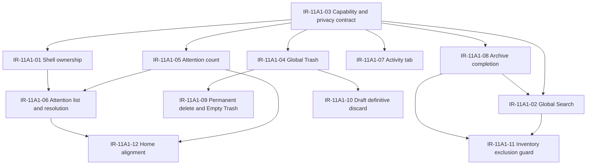

# Planner V1 M11 - 11A.1 Global Surfaces Technical Readiness Audit

Status: final audit
Date: 2026-08-02
Lane: Planner V1 / M11 / 11A.1
Branch: `planner-v1-11a-1-global-surfaces-technical-readiness`
Worktree: `C:\Users\thega\Desktop\HomePlus-worktrees\integration`
Base: `e43f44ff218349b12b31e3f345f4998fc1e62d92`
Mode: read-only technical readiness audit

## 1. Executive Summary

Verdict:

`PLANNER_GLOBAL_SURFACES_TECHNICAL_READINESS_READY_WITH_PRECONDITIONS`

The repository is technically ready to start implementation of Planner V1 Global Surfaces, but not ready for a blind implementation pass. The current codebase already provides several important foundations: a mounted shell top bar, a single quick-action sheet host, a Planner Search placeholder route, a Planner Trash screen, a backend Trash aggregation service for Tasks/Events/Goals/Milestones, backend Activity logging, Planner capabilities, Home summary consolidation, and the productive mutation reliability runtime.

However, the frozen product surface is broader than the current implementation. The largest gaps are:

- Global Search is a placeholder screen, scoped as Planner Search, with no query input, indexing, productive search endpoint, archived/trash contexts, or global shell entry.
- Global Attention does not exist as a shared AppTopBar surface; current Home "Atencion requerida" is only a legacy summary card.
- Global Activity is backend-only and Planner-scoped; there is no global Activity tab, grouping model, or frontend surface.
- Global Trash is Planner-scoped and incomplete; it omits Presets and excludes Drafts correctly for global trash, but lacks permanent delete and Empty Trash.
- Archive is materially underbuilt for the frozen 11A scope; Plan archive exists structurally but is capability-disabled, while Task/Event/Preset contextual archive is missing.
- Draft discard still behaves as recoverable trash/restore, conflicting with the frozen immediate definitive discard rule.
- Reliability is strong for core Task/Event/Plan/Preset/Draft mutations, but some existing flows still bypass the productive runtime and future permanent destructive operations have no offline-safe design.

Recommendation: proceed to implementation only after integration accepts explicit preconditions for IR-11A1-01 through IR-11A1-12 below. The safest path is to build the global shell entry points first, then implement each surface behind capability and feature gates, preserving existing Planner-scoped screens as internal or transitional routes until the global surfaces own navigation.

## 2. Audit Scope

This audit covers only technical readiness. It does not implement new behavior, run migrations, call Supabase, push commits, or alter remote state.

Included:

- Frontend shell, navigation, AppTopBar, More, Home, Planner screens.
- Existing Quick Actions, Search, Trash, Drafts, Archive, Activity, Summary, and Reliability code.
- Backend controllers, routes, services, capability checks, and privacy-sensitive patterns.
- Supabase migration files only as static source evidence.
- Existing tests and scripts as static evidence.

Excluded:

- Supabase runtime execution.
- Production or preview deployment.
- Test execution beyond repository validation commands.
- API contract changes.
- UI implementation.
- Schema migrations.

## 3. Repository Baseline And Guardrails

Observed state:

- Worktree path: `C:\Users\thega\Desktop\HomePlus-worktrees\integration`
- Branch at start: `planner-v1-11a-1-global-surfaces-technical-readiness`
- Expected branch name: `planner-v1-11a-1-global-surfaces-technical-readiness`
- Expected base commit: `e43f44ff218349b12b31e3f345f4998fc1e62d92`
- Actual HEAD at start: `e43f44ff218349b12b31e3f345f4998fc1e62d92`
- Working tree at start: clean
- Merge/rebase/cherry-pick/bisect state: none detected

Important note: the worktree was already on the target audit branch when the audit began. HEAD matched the required base commit exactly, so no branch creation or checkout was required.

Operational guardrails followed:

- No remotes were touched.
- No Supabase commands were run.
- No application code was modified.
- Only this audit document was created.

## 4. Authority Documents Read

The following authority documents were read before classification:

- `docs/implementation/planner/PLANNER_V1_M11_FUNCTIONAL_FREEZE.md`
- `docs/implementation/planner/PLANNER_V1_M11_FINAL_DECISION_REGISTRY.md`
- `docs/implementation/planner/PLANNER_V1_M11_UX_UI_FREEZE_CONTRACT.md`
- `docs/implementation/planner/M11_11A_P4_GLOBAL_SURFACES_PRODUCT_FREEZE.md`
- `docs/implementation/planner/M11_11A_P0_GLOBAL_SURFACES_INVENTORY.md`
- `docs/implementation/planner/M11_11A_P1_DATA_MODEL_EVIDENCE.md`
- `docs/implementation/planner/M11_11A_P2_BACKEND_CAPABILITY_PRIVACY_AUDIT.md`
- `docs/implementation/planner/M11_11A_P2_FRONTEND_NAV_SURFACES_AUDIT.md`
- `docs/implementation/planner/M11_11A_P2_OFFLINE_RELIABILITY_AUDIT.md`
- `docs/implementation/planner/M11_11A_P2_TEST_TELEMETRY_AUDIT.md`
- `docs/implementation/planner/M11_11A_P3_CONFLICTS_AND_DECISIONS.md`

Primary frozen contracts applied:

- Global Search: active and archived contexts included; Inventory excluded; Trash context must be explicit.
- Global Attention and Activity: shared AppTopBar surface with unresolved badge only for Attention.
- Global Trash: local filtered entries, Drafts excluded, permanent delete and Empty Trash restricted to Trash and coordinator role.
- Archive: contextual per module; global archive surface rejected; Inventory archive deferred.
- Drafts: meaningful draft discard is immediate definitive discard after confirmation.
- Quick Actions: remain create-only; no search-as-tile, inventory, templates, trash, archive, or draft entry.

## 5. Classification Model

Readiness classifications used in this audit:

- `READY`: implementation foundation appears sufficient for the frozen behavior with only normal wiring.
- `PARTIAL`: meaningful implementation exists, but frozen behavior requires additional design or code.
- `MISSING`: no implementation matching the frozen behavior was found.
- `BLOCKED`: implementation should not begin until a product or architecture decision is resolved.
- `CONFLICT`: current behavior contradicts the frozen product decision.
- `DEFERRED_BY_FREEZE`: frozen contract explicitly excludes or defers the surface.

## 6. Frozen Requirement Readiness Matrix

| Requirement | Frozen behavior | Current implementation | Evidence | Classification | Frontend gap | Backend gap | Data gap | Permission gap | Reliability gap | Test gap | Dependency | Probable owner | Proposed IR | Recommendation |
| --- | --- | --- | --- | --- | --- | --- | --- | --- | --- | --- | --- | --- | --- | --- |
| Quick Actions as create-only | Center Add opens quick creation for Task/Event/Plan only | Implemented with PlannerSheetHost and capability-filtered catalog | `front/mi-front-limpio/navigation/HomeTabNavigator.tsx:168`, `front/mi-front-limpio/components/planner/QuickActionsMenu.tsx:39`, `front/mi-front-limpio/services/planner/plannerQuickActions.ts:88` | READY | None for 11A | None | None | Existing capability gate | Existing create flows use reliability for Task/Event/Plan graph | Existing quick action tests cover absence of Search | None | Frontend | None | Keep stable; do not expand the catalog |
| Search entry from shell/top bar | Global Search is a top search bar/icon, not a Quick Action tile | AppTopBar supports `rightSlot`, but no search entry is mounted; Planner Search route is inside Planner stack | `front/mi-front-limpio/components/ui/AppTopBar.tsx:10`, `front/mi-front-limpio/navigation/HomeTabNavigator.tsx:217`, `front/mi-front-limpio/navigation/HomeTabNavigator.tsx:148` | PARTIAL | Add shell search entry and navigation ownership | Add global search API | Search index/model absent | Capability needs global treatment | Query should not enqueue; stale/offline state must be designed | Search surface tests missing | IR-11A1-01 | Frontend + Backend | IR-11A1-01 | Build global entry first, keep PlannerSearch as transitional |
| Productive Global Search active context | Search active Tasks/Events/Plans/Presets as allowed; Inventory excluded | PlannerSearchScreen is explicitly non-productive and has no input/results | `front/mi-front-limpio/screens/planner/PlannerSearchScreen.tsx:1`, `front/mi-front-limpio/services/planner/plannerSearchStates.ts:10`, `backend/src/routes/planner.js:34` | MISSING | Input, result list, modules, navigation targets | `/api/planner/search` or global route missing | Need query projection for entities | Need per-entity visibility and capability filtering | Offline stale/error states needed | No productive search tests | IR-11A1-02 | Backend + Frontend | IR-11A1-02 | Backend-authoritative search; no client merge |
| Search archived context | Archived content searchable when user selects archived context | No Task/Event/Preset archive implementation; Plan archive blocked | `backend/src/lib/plannerCapabilities.js:84`, `backend/src/services/planner.plans.service.js:242` | BLOCKED | Archived filter UI absent | Archive APIs incomplete | Archived fields inconsistent by entity | Archive capabilities false | Archive mutation runtime incomplete | Archive tests absent | IR-11A1-08 | Backend + Product | IR-11A1-08 | Implement archive contract before archived search |
| Search Trash context | Trash search only from explicit Trash context | Planner Trash list exists, but no search within it | `front/mi-front-limpio/screens/planner/PlannerTrashScreen.tsx:31`, `backend/src/services/planner.trash.service.js:202` | PARTIAL | Add Trash search/filter affordance | Add query support to trash API or global search context | Preset trash omitted; drafts excluded | Coordinator destructive ops need separate gates | Restore partly reliability-backed | Tests missing | IR-11A1-04 | Frontend + Backend | IR-11A1-04 | Add after Trash aggregation is completed |
| Attention AppTopBar badge | Shared AppTopBar Attention icon with unresolved count badge | No Attention icon or badge in AppTopBar; only optional `rightSlot` | `front/mi-front-limpio/components/ui/AppTopBar.tsx:56`, `front/mi-front-limpio/navigation/HomeTabNavigator.tsx:217` | MISSING | Add icon, badge, sheet/screen navigation | Add Attention endpoint/count | Need stable attention item model | Need household and personal visibility | Resolution mutation semantics missing | No Attention tests | IR-11A1-05 | Frontend + Backend | IR-11A1-05 | Design unresolved count contract first |
| Attention list and resolution | Attention shows actionable unresolved items and supports resolution | No global Attention service; Home card shows legacy counts only | `front/mi-front-limpio/screens/home/HomePlannerSections.tsx:270` | MISSING | Global list UI absent | No attention aggregation endpoint | No attention table/projection found | Capability matrix absent | Resolution must be productive/idempotent | No tests | IR-11A1-06 | Backend + Frontend | IR-11A1-06 | Derive signals server-side from existing sources first |
| Activity tab in shared surface | Activity is second tab; read-only, no badge/read state | Backend Planner activity list exists; no global UI/tab | `backend/src/controllers/planner.activity.controller.js:21`, `backend/src/services/planner.activity.service.js:159` | PARTIAL | Add tab and read-only activity list | Scope/group/pagination contract incomplete | Activity table exists but entity scope limited | Needs privacy minimization | Read-only, no enqueue needed | No global activity tests | IR-11A1-07 | Frontend + Backend | IR-11A1-07 | Reuse backend log after contract hardening |
| Global Trash aggregation | Trash includes Task/Event/Plan/Preset trash where supported; Drafts excluded | Planner trash aggregates Tasks/Events/Goals/Milestones only | `backend/src/services/planner.trash.service.js:202`, `backend/src/routes/planner.presets-drafts.js:9` | PARTIAL | UI filters lack Presets/Plans naming consistency | Presets missing from aggregation; Plans naming inconsistent with Goals | Preset trash exists; Plans table has trashed_at | Need per-entity restore capabilities | Restore mixed reliability/direct | Tests incomplete | IR-11A1-04 | Backend + Frontend | IR-11A1-04 | Complete aggregation before destructive actions |
| Drafts excluded from Global Trash | Drafts do not appear in global trash | Current global Planner Trash does not include drafts | `backend/src/services/planner.trash.service.js:202`, `backend/src/services/planner.drafts.service.js:55` | READY_WITH_RISK | Ensure future global trash does not add drafts | Existing draft trash endpoint conflicts with discard freeze | Drafts still have trashed_at | Personal owner rules exist | Draft discard behavior conflicts | Tests currently expect draft trash/restore | IR-11A1-10 | Frontend + Backend | IR-11A1-10 | Preserve exclusion while changing discard semantics |
| Permanent delete | Only inside Trash; coordinator only; no offline support | No implementation found | `docs/implementation/planner/M11_11A_P4_GLOBAL_SURFACES_PRODUCT_FREEZE.md:92`, `front/mi-front-limpio/screens/planner/PlannerTrashScreen.tsx:216` | MISSING | Add restricted action and confirmation | Add permanent delete endpoints | Need per-entity hard-delete or tombstone policy | Coordinator-only gate absent | Must be online-only and non-queued | No tests | IR-11A1-09 | Backend + Frontend + Data | IR-11A1-09 | Treat as separate destructive-operation vertical |
| Empty Trash | Only inside Trash; coordinator only; no offline support | No implementation found | `docs/implementation/planner/PLANNER_V1_M11_UX_UI_FREEZE_CONTRACT.md:190`, `backend/src/services/planner.trash.service.js:202` | MISSING | Add empty trash affordance | Add bulk destructive endpoint | Need retention and per-entity semantics | Coordinator-only gate absent | Must block offline | No tests | IR-11A1-09 | Backend + Frontend + Data | IR-11A1-09 | Implement after permanent delete contracts |
| Task archive | Contextual module archive, not global archive | Capability key exists but denied; no task archive routes found | `backend/src/lib/plannerCapabilities.js:107`, `backend/src/routes/planner.js:59` | MISSING | Task action UI absent | Task archive/unarchive missing | Need `archived_at` evidence/contract | Capability currently false | Runtime adapter lacks archive operation | Tests absent | IR-11A1-08 | Backend + Data + Frontend | IR-11A1-08 | Do not expose archived search until implemented |
| Event archive | Contextual module archive, not global archive | No event archive routes found | `backend/src/routes/planner.js:70`, `backend/src/lib/plannerCapabilities.js:84` | MISSING | Event action UI absent | Event archive/unarchive missing | Need `archived_at` evidence/contract | Capability missing or false | Runtime adapter lacks archive operation | Tests absent | IR-11A1-08 | Backend + Data + Frontend | IR-11A1-08 | Align with Task archive semantics |
| Plan archive | Contextual archive for plans/goals | Plan service and migration support archive, but capability is denied | `backend/src/services/planner.plans.service.js:140`, `backend/src/lib/plannerCapabilities.js:125`, `supabase/migrations/20260722040000_m11_3a_plan_graph_foundation.sql:49` | PARTIAL | UI actions may not surface due capability false | Controller maps archive to `goal.archive` | `archived_at` exists | Capability denied all roles | Plan graph write path exists | Need enabled-path tests | IR-11A1-08 | Backend + Product | IR-11A1-08 | Decide whether 11A means enabling existing Plan archive |
| Preset archive | Contextual archive for Presets | Preset trash/restore exists; archive not found | `backend/src/routes/planner.presets-drafts.js:9`, `front/mi-front-limpio/services/planner/reliability/productiveAdapters.ts:236` | MISSING | Preset archive UI absent | Archive endpoints absent | Need archive field/policy | Capability absent | Runtime adapter lacks archive | Tests absent | IR-11A1-08 | Backend + Data + Frontend | IR-11A1-08 | Clarify Preset archive storage before implementation |
| Inventory archive | Deferred by freeze | Inventory has delete/soft-delete, no Planner archive | `backend/src/routes/inventory.js:9`, `backend/src/services/inventory.service.js:378` | DEFERRED_BY_FREEZE | None for 11A | None for 11A | Current deleted_at is Inventory-local | None for 11A | None for 11A | Ensure exclusion tests | IR-11A1-11 | Product + Backend | IR-11A1-11 | Explicitly exclude Inventory from 11A global work |
| Draft discard | Meaningful draft discard is definitive after confirmation | Drafts still support trash and restore | `backend/src/routes/planner.presets-drafts.js:22`, `backend/src/services/planner.drafts.service.js:99`, `front/mi-front-limpio/components/planner/drafts/PlannerDraftsScreen.tsx:190` | CONFLICT | Replace trash/restore discard UI | Replace trash/restore endpoints or hide from UI | Draft table has retention model | Owner-person guard exists | Draft discard currently reliability-backed as recoverable | Existing tests expect recoverable behavior | IR-11A1-10 | Product + Backend + Frontend | IR-11A1-10 | Resolve before Global Trash release |
| Home Planner summary | Home card remains backend-authored, max 3 Tasks/3 Events/1 Plan | Implemented with single summary request and deterministic service | `front/mi-front-limpio/services/plannerSummary.ts:31`, `backend/src/services/planner.summary.service.js:10` | READY_WITH_RISK | Home has legacy wording and direct complete flow | Summary endpoint exists | Entity eligibility mostly defined | Capability asserted | One-tap complete bypasses reliability runtime | Smoke only; no broad global test | IR-11A1-12 | Frontend | IR-11A1-12 | Keep Home out of Global Surface ownership except entry points |
| Home Attention card | Global Attention should be AppTopBar, not Home-local surface | Home still renders "Atencion requerida" from summary counts | `front/mi-front-limpio/screens/home/HomePlannerSections.tsx:270` | CONFLICT | Remove or demote after global Attention exists | None | Summary counts not Attention items | Capability inherited from summary | N/A | Tests need update | IR-11A1-12 | Frontend + Product | IR-11A1-12 | Avoid two competing Attention surfaces |
| AppTopBar shared ownership | AppTopBar owns cross-app entry points | Top bar only receives avatar/household props; `rightSlot` unused | `front/mi-front-limpio/navigation/HomeTabNavigator.tsx:217`, `front/mi-front-limpio/components/ui/AppTopBar.tsx:10` | PARTIAL | Define shell slot composition | Badge/count endpoints needed | N/A | Role-aware display needed | N/A | Shell tests absent | IR-11A1-01 | Frontend | IR-11A1-01 | Add a dedicated global surfaces right slot |
| More entry for Trash | More -> Papelera entry exists in frozen UX | More currently lists Feed and Inventory only | `front/mi-front-limpio/screens/MoreScreen.tsx:11` | MISSING | Add Papelera navigation | Reuse/complement Trash API | N/A | Capability gate needed | N/A | More navigation tests absent | IR-11A1-04 | Frontend | IR-11A1-04 | Add only after global Trash route is ready |
| Capability source of truth | Backend capabilities remain authoritative | `plannerCapabilities.js` centralizes capability catalog and role matrix | `backend/src/lib/plannerCapabilities.js:13` | READY_WITH_RISK | Frontend must consume, not infer | Extend catalog for global surfaces | N/A | Need new keys for global trash/attention/destructive ops | N/A | Capability tests need extension | IR-11A1-03 | Backend | IR-11A1-03 | Extend before UI unlock |
| Privacy and household isolation | Surfaces must be household scoped and personal visibility safe | Summary and activity are household-scoped; Goals personal visibility handled; Tasks lack personal visibility evidence | `backend/src/services/planner.summary.service.js:61`, `backend/src/services/planner.summary.service.js:199`, `backend/src/services/planner.activity.service.js:159` | PARTIAL | UI cannot leak hidden counts | Server filters must be authoritative | Need per-entity visibility inventory | Capabilities alone insufficient | N/A | Privacy regression tests missing | IR-11A1-03 | Backend + QA | IR-11A1-03 | Build shared result sanitizer/filter |
| Reliability for global mutations | Destructive/restorative mutations must be idempotent; permanent delete is online-only | Productive runtime exists for many operations; direct paths remain | `front/mi-front-limpio/services/planner/reliability/productiveMutations.ts:49`, `front/mi-front-limpio/screens/home/HomePlannerSections.tsx:203`, `front/mi-front-limpio/screens/planner/PlannerTrashScreen.tsx:111` | PARTIAL | Route all eligible global restore/archive through runtime | Ensure idempotency identities backend-side | N/A | Capability checks per mutation | Permanent delete must bypass queue with online guard | Existing reliability tests do not cover global surfaces | IR-11A1-09 | Frontend + Backend | IR-11A1-09 | Separate queued restore from online-only hard delete |

## 7. Frontend Readiness

### 7.1 Shell And Navigation

The current shell can host global surfaces but does not yet own them.

Key evidence:

- `HomeTabNavigator` mounts `AppTopBar` globally, but only passes `household`, `onPressAvatar`, and `onPressHousehold`.
- `AppTopBar` supports a generic `rightSlot`, but the navigator does not pass a slot.
- `PlannerSearch` and `PlannerTrash` are nested inside the Planner stack, not exposed as global cross-app surfaces.
- `MoreScreen` does not include `Papelera`.

Readiness:

- Shell mounting: `READY`
- AppTopBar extensibility: `READY_WITH_RISK`
- Global surface routing: `PARTIAL`
- Global Search entry: `MISSING`
- Global Attention entry: `MISSING`
- More -> Trash entry: `MISSING`

Technical risk: if global surfaces are added as Planner-only routes, they will conflict with the freeze's shared AppTopBar model and produce duplicate entry points later.

### 7.2 Quick Actions

Quick Actions are aligned with the freeze. The center Add tab calls `sheet.openActions()`, and the menu catalog contains only:

- `create_task`
- `create_event`
- `create_goal`

The Quick Actions implementation correctly avoids Search, Inventory, Templates, Trash, Archive, and Drafts.

One stale label exists in `plannerQuickActions.ts`: a comment still says "Goal is deferred to M5" while create goal/plan is implemented. This is documentation drift, not a functional blocker for 11A.

### 7.3 Search

Search is not implementation-ready as a product surface. It has a placeholder navigation state machine and capability access checks, but no productive search behavior.

Evidence:

- `PlannerSearchScreen.tsx` says it performs no backend requests, input, mocks, query, debounce, ranking, or results.
- `plannerSearchStates.ts` explicitly does not implement productive states such as typing, loading results, results, empty results, or error.
- Backend `planner.js` exposes no search endpoint.

Recommended architecture:

- Create a backend-authoritative search endpoint.
- Keep Inventory excluded.
- Model contexts explicitly: `active`, `archived`, `trash`.
- Keep Trash search reachable only inside Trash context.
- Apply capability and visibility filtering server-side.
- Return normalized result cards with entity type, id, title, subtitle, state, source module, and navigation target.

### 7.4 Attention And Activity

Attention is missing. Activity is partially present backend-side.

Attention must not be built from Home summary counts alone. The frozen surface requires unresolved actionable items, count semantics, and resolution behavior. Existing signals exist in Tasks and reliability state, but no stable Attention item projection was found.

Activity has a backend service that lists `planner_activity_log`, but it is not yet global:

- Entity types are limited to task/event/goal/milestone.
- No grouped day model was found.
- No pagination cursor was found.
- No AppTopBar tab/sheet was found.

Recommended architecture:

- Define a shared "attention activity surface" endpoint family.
- `GET /api/planner/attention/count`
- `GET /api/planner/attention`
- `POST /api/planner/attention/:id/resolve` or entity-native mutation mapping
- `GET /api/planner/activity`
- Keep Activity read-only and badge-free.
- Make Attention badge count server-authored.

### 7.5 Trash

The existing Trash implementation is a useful foundation but not yet the frozen Global Trash.

Current included entity types:

- Tasks
- Events
- Goals
- Milestones

Current omitted entity types:

- Presets, despite existing preset trash/restore routes
- Plans as named frozen entity, though current code uses goals/plans terminology inconsistently
- Drafts, correctly omitted from global trash but still recoverable in Drafts UI
- Inventory, correctly excluded or deferred

The current Trash UI supports restore only. Permanent delete and Empty Trash are absent.

Recommended architecture:

- Complete aggregation for supported non-draft Planner entities.
- Add role-gated coordinator-only destructive actions.
- Keep permanent delete and Empty Trash online-only and not queued.
- Keep restore operations reliability-backed where possible.
- Add `More -> Papelera` only when the global route is ready.

### 7.6 Archive

Archive is the least ready frozen surface after Attention.

Findings:

- Plan/goal archive exists structurally in the plan graph service and migration.
- `goal.archive` and `task.archive` capabilities are false for all roles.
- Task archive routes were not found.
- Event archive routes were not found.
- Preset archive routes were not found.
- Inventory archive is deferred by freeze.

Recommendation: do not implement archived search before the archive model is normalized. The archived context of Search depends on Archive semantics being real and role-safe.

### 7.7 Draft Discard

Draft discard is in conflict with the frozen decision.

Current behavior:

- Drafts have `trashed_at` and `retention_expires_at`.
- Draft routes include trash and restore.
- Drafts UI displays active and trashed drafts.
- Tests expect draft trash/restore.

Frozen behavior:

- Meaningful draft discard requires confirmation.
- Confirmed discard is immediate and definitive.
- Drafts do not appear in Global Trash.

Required decision: either replace recoverable draft trash/restore with definitive discard for 11A, or explicitly defer this correction with a signed integration exception. Without that, Global Trash and Drafts behavior will contradict the product freeze.

## 8. Backend Readiness

### 8.1 Existing Strengths

The backend already has useful primitives:

- Central capability catalog in `plannerCapabilities.js`.
- Summary endpoint guarded by `planner.view`.
- Activity logging and listing service.
- Trash aggregation service.
- Entity restore/trash endpoints for Tasks, Events, Goals/Milestones, Presets, and Drafts.
- Plan graph RPC support for archive/unarchive.

### 8.2 Backend Gaps

Missing or incomplete backend contracts:

- Global search endpoint.
- Attention count/list/resolve endpoint.
- Global activity contract with grouping/pagination/privacy minimization.
- Global trash endpoint covering all supported frozen entity types.
- Permanent delete endpoint.
- Empty Trash endpoint.
- Task/Event/Preset archive endpoints.
- Online-only enforcement for permanent destructive operations.
- Capability keys for global surfaces and coordinator-only destructive actions.

### 8.3 Suggested Endpoint Shape

Suggested endpoint grouping:

- `GET /api/planner/global-search`
- `GET /api/planner/global-trash`
- `POST /api/planner/global-trash/:entityType/:id/restore`
- `DELETE /api/planner/global-trash/:entityType/:id`
- `DELETE /api/planner/global-trash`
- `GET /api/planner/global-attention/count`
- `GET /api/planner/global-attention`
- `POST /api/planner/global-attention/:attentionId/resolve`
- `GET /api/planner/global-activity`

The exact route names can follow local route conventions, but the ownership should be global-surface oriented rather than hidden inside unrelated module controllers.

## 9. Data Readiness

Data readiness is mixed.

Known available source fields:

- Tasks: `trashed_at` present in trash service queries.
- Events: `trashed_at` present in trash service queries.
- Goals/Plans: `trashed_at`, `archived_at`, and terminal state concepts exist in plan graph code.
- Milestones: trash and restore service support exists.
- Presets: trash and restore routes exist.
- Drafts: recoverable trash state exists, but conflicts with freeze.
- Inventory: local deleted/restock patterns exist, but archive is deferred.
- Activity: `planner_activity_log` exists as a backend dependency.

Data gaps:

- Search projection/index contract.
- Attention item projection and stable IDs.
- Preset inclusion in global trash.
- Archive fields or policy for Task/Event/Preset.
- Permanent delete/tombstone/retention policy per entity.
- Count semantics for Attention.
- Shared visibility sanitizer across search, attention, activity, and trash.

## 10. Permissions And Privacy Readiness

The capability system is a solid foundation, but 11A needs explicit new keys and tests.

Existing evidence:

- `plannerCapabilities.js` declares itself the single source of truth for Planner capabilities.
- Summary controller asserts `planner.view`.
- Summary service filters goals with personal visibility logic.
- Activity list is household-scoped.

Risks:

- Search can leak private titles/descriptions if implemented by client-side merging or incomplete filters.
- Activity can leak entity names or actions unless payloads are minimized.
- Attention counts can leak private item existence if counts include invisible items.
- Trash can expose deleted content to non-authorized roles without per-entity restore/delete capability checks.
- Permanent delete and Empty Trash must be coordinator-only, and should not rely on frontend-only gating.

Recommended permission keys:

- `planner.globalSearch.view`
- `planner.attention.view`
- `planner.attention.resolve`
- `planner.activity.view`
- `planner.trash.view`
- `planner.trash.restore`
- `planner.trash.deletePermanent`
- `planner.trash.empty`
- `task.archive`
- `event.archive`
- `goal.archive`
- `preset.archive`

## 11. Reliability And Offline Readiness

The productive mutation runtime is a strength. It supports confirmed enqueue behavior, retry/replay, conflict intent, identity stability, cache invalidation, and visual states.

Ready or mostly ready:

- Task create/update/complete/verify/cancel/trash/restore/reactivate.
- Event create/update/cancel/restore/occurrence override.
- Plan graph write.
- Preset trash/restore.
- Draft trash/restore, though semantics conflict with freeze.

Not ready:

- Global permanent delete.
- Empty Trash.
- Archive/unarchive for Task/Event/Preset.
- Attention resolve if it maps to entity mutations.
- Search offline/stale result model.
- Direct Home one-tap task completion, which bypasses the productive runtime.
- Direct goal/milestone restore from Planner Trash.

Recommendation:

- Queue only reversible or idempotent productive mutations.
- Make permanent delete and Empty Trash online-only, with explicit network and server confirmation.
- Use a single global invalidation path for Search, Attention, Activity, Trash, and Home summary after mutations.

## 12. Testing Readiness

Existing useful tests:

- Quick Actions catalog and hidden Search tile expectations.
- Planner Search transition placeholder tests.
- Planner summary/Home smoke checks.
- Reliability runtime tests for replay, identity, retries, user/household switch, and conflict intent.
- Presets/Drafts integration and frontend tests.
- Planner M11 contract tests for Goal/Milestone restore version passing.

Missing required tests:

- Productive Global Search active context.
- Search archived context.
- Search Trash context.
- Search privacy and capability filtering.
- Attention count/list/resolve.
- Activity global tab and privacy behavior.
- Global Trash aggregation including Presets and excluding Drafts.
- Permanent delete coordinator-only behavior.
- Empty Trash coordinator-only behavior.
- Online-only enforcement for permanent destructive operations.
- Archive/unarchive for Task/Event/Preset/Plan.
- Draft definitive discard.
- AppTopBar badge and navigation behavior.
- More -> Papelera navigation.
- No duplicate Attention/Home-local global surface regression.

## 13. Technical Options

### 13.1 Global Search

Option A: backend-authoritative federated search

- Query each eligible table/service server-side.
- Apply capability and visibility filters before returning results.
- Normalize to a shared result shape.
- Supports active, archived, and trash contexts.

Pros:

- Best privacy posture.
- Avoids client-side leakage.
- Easier to test with role fixtures.
- Matches Home summary's backend-authoritative pattern.

Cons:

- Requires backend work before UI can be truly productive.
- Requires shared ranking rules.

Recommendation: choose Option A.

Option B: client-side aggregation

- Client calls existing endpoints and merges results locally.

Pros:

- Faster first UI prototype.

Cons:

- Higher privacy risk.
- More request fan-out.
- Harder capability behavior.
- Conflicts with backend-authoritative Home summary precedent.

Recommendation: reject for production implementation.

### 13.2 Attention

Option A: derived server-side attention projection

- Generate attention items from existing entity states such as awaiting verification, conflicts, stale overdue items, and reliability conflict states.
- Return stable derived IDs and action descriptors.

Pros:

- Avoids new source-of-truth table initially.
- Easier to keep Attention aligned with existing entity mutations.

Cons:

- Requires careful stable ID and de-duplication rules.

Recommendation: choose Option A for 11A.

Option B: new persisted attention table

- Store attention items independently.

Pros:

- Strong lifecycle control.

Cons:

- Higher migration and synchronization risk.
- More likely to duplicate entity truth.

Recommendation: defer unless derived model proves insufficient.

### 13.3 Trash And Permanent Delete

Option A: aggregator plus entity-native destructive handlers

- Global Trash lists normalized items.
- Restore/delete dispatches to entity-specific server handlers.
- Empty Trash orchestrates entity handlers transactionally where possible.

Pros:

- Respects existing entity logic.
- Easier to keep capability rules entity-aware.

Cons:

- Needs careful partial failure handling for Empty Trash.

Recommendation: choose Option A.

Option B: direct table-level global hard delete

Pros:

- Simple route surface.

Cons:

- High integrity risk.
- Can bypass domain invariants and activity logging.

Recommendation: reject.

### 13.4 Archive

Option A: normalize archive as entity-native contextual action

- Add archive/unarchive for Task/Event/Preset.
- Enable existing Plan archive only after capability and UI decisions.
- Feed archived search from these entity-native states.

Pros:

- Matches freeze.
- Avoids accidental global archive page.

Cons:

- Requires schema/API alignment.

Recommendation: choose Option A.

## 14. Open Contradictions

1. Drafts conflict with frozen discard semantics.
   - Current code supports draft trash/restore.
   - Freeze requires confirmed discard to be definitive.

2. Home has a local Attention-like section.
   - Current Home card says "Atencion requerida".
   - Freeze moves Attention to a shared AppTopBar surface.

3. Plan archive exists but is capability-disabled.
   - Service and migration support archive/unarchive.
   - Capability matrix denies archive for every role.

4. Search route exists but intentionally cannot search.
   - Product freeze expects active Search.
   - Current screen is a non-productive placeholder.

5. Activity backend exists but not as frozen surface.
   - Current endpoint is Planner-scoped list activity.
   - Freeze expects shared surface tab beside Attention.

## 15. Integration Requests

### IR-11A1-01 - Global Surface Shell Ownership

Problem: AppTopBar can host a right slot, but no global Search/Attention entry is mounted and routes are Planner-scoped.

Frozen requirement:

- Search, Attention, and Activity are shared/global surfaces.
- Attention and Activity live in the shared AppTopBar surface.
- Quick Actions remain create-only.

Evidence:

- `front/mi-front-limpio/components/ui/AppTopBar.tsx:10`
- `front/mi-front-limpio/navigation/HomeTabNavigator.tsx:217`
- `front/mi-front-limpio/navigation/HomeTabNavigator.tsx:148`

Owner: Frontend.

Dependencies: IR-11A1-02, IR-11A1-05, IR-11A1-07.

Scope:

- Add explicit global-surface composition to AppTopBar usage.
- Add Search and Attention entry points.
- Keep Quick Actions unchanged.
- Add global routes or modal/sheet hosts owned by the app shell.

Exclusions:

- No new Quick Actions entries.
- No Inventory global search.

Risk: duplicate or conflicting navigation if existing Planner routes remain primary.

Acceptance criteria:

- AppTopBar shows global Search and Attention according to role/capability.
- Attention badge is shown only for unresolved Attention count.
- Activity has no badge/read state.
- Planner Search is not the only route to Search.
- Quick Actions catalog still has only Task/Event/Plan creation.

Order: implement before user-facing Global Search/Attention UI work.

### IR-11A1-02 - Backend-Authoritative Global Search

Problem: current Search is a placeholder with no productive query path.

Frozen requirement:

- Search is active by default.
- Archived context is searchable.
- Trash context is explicit.
- Inventory is excluded.

Evidence:

- `front/mi-front-limpio/screens/planner/PlannerSearchScreen.tsx:1`
- `front/mi-front-limpio/services/planner/plannerSearchStates.ts:10`
- `backend/src/routes/planner.js:34`

Owner: Backend plus Frontend.

Dependencies: IR-11A1-03 and IR-11A1-08.

Scope:

- Define normalized search result DTO.
- Implement backend search endpoint.
- Implement frontend input/results/loading/empty/error states.
- Support `active`, `archived`, and `trash` contexts.

Exclusions:

- Inventory search.
- Quick Action search tile.
- Client-side endpoint fan-out as production behavior.

Risk: privacy leakage through titles, descriptions, hidden personal plans, or trash content.

Acceptance criteria:

- Empty query behavior is deterministic.
- Results are role-filtered server-side.
- Archived results appear only when archive is implemented and selected.
- Trash results appear only in explicit Trash context.
- Offline and server-error states are visible and test-covered.

Order: after capability/privacy keys and before global Search launch.

### IR-11A1-03 - Global Surface Capability And Privacy Contract

Problem: current capability catalog does not define all global surface operations.

Frozen requirement:

- Global surfaces are role-safe and household-safe.
- Coordinator-only destructive operations are enforced server-side.

Evidence:

- `backend/src/lib/plannerCapabilities.js:13`
- `backend/src/controllers/planner.summary.controller.js:37`
- `backend/src/services/planner.summary.service.js:199`
- `backend/src/services/planner.activity.service.js:159`

Owner: Backend.

Dependencies: none.

Scope:

- Add capabilities for global Search, Attention, Activity, Trash, restore, permanent delete, Empty Trash, and archive.
- Define entity visibility filters shared by Search, Attention, Activity, and Trash.
- Add backend tests for role and household isolation.

Exclusions:

- Frontend-only authorization.

Risk: counts or result rows can leak invisible entity existence.

Acceptance criteria:

- Every global-surface endpoint asserts a capability.
- Every returned row has passed entity-specific visibility filtering.
- Attention counts match the visible Attention list.
- Activity payloads are minimized for privacy.
- Coordinator-only operations fail server-side for other roles.

Order: first backend dependency for all global surfaces.

### IR-11A1-04 - Complete Global Trash Aggregation

Problem: Trash aggregation exists for Tasks/Events/Goals/Milestones only.

Frozen requirement:

- Global Trash is a local filtered trash surface.
- Drafts do not appear.
- Permanent delete and Empty Trash exist only inside Trash and are coordinator-only.

Evidence:

- `backend/src/services/planner.trash.service.js:202`
- `front/mi-front-limpio/screens/planner/PlannerTrashScreen.tsx:31`
- `backend/src/routes/planner.presets-drafts.js:9`

Owner: Backend plus Frontend.

Dependencies: IR-11A1-03, IR-11A1-09, IR-11A1-10.

Scope:

- Normalize supported Trash entity types.
- Include Presets if product confirms Presets are in 11A Global Trash.
- Preserve Draft exclusion.
- Add More -> Papelera.
- Add search/filter behavior inside Trash if required by Search context.

Exclusions:

- Inventory archive/trash.
- Draft Trash inclusion.

Risk: adding Drafts by reusing existing draft trash APIs would violate freeze.

Acceptance criteria:

- Trash lists every supported frozen entity type and no Drafts.
- Restore is available only where supported and authorized.
- Trash route is reachable from More.
- Empty states and loading/error states are tested.

Order: before permanent delete and Empty Trash UI.

### IR-11A1-05 - Attention Count And Badge Contract

Problem: no Attention surface or unresolved count exists.

Frozen requirement:

- AppTopBar shows Attention icon with unresolved badge.
- Badge belongs only to Attention, not Activity.

Evidence:

- `front/mi-front-limpio/components/ui/AppTopBar.tsx:56`
- `front/mi-front-limpio/screens/home/HomePlannerSections.tsx:270`

Owner: Backend plus Frontend.

Dependencies: IR-11A1-03.

Scope:

- Define unresolved Attention item types.
- Implement count endpoint.
- Add AppTopBar badge component.
- Ensure count is role-filtered and household-filtered.

Exclusions:

- Activity badge.
- Home-local Attention replacement before global surface exists.

Risk: badge count mismatch with list if query logic diverges.

Acceptance criteria:

- Count equals unresolved visible Attention items.
- Count updates after resolution or relevant entity mutation.
- Empty count hides badge.
- Household switch invalidates count.

Order: before Attention list launch.

### IR-11A1-06 - Attention List And Resolution Flow

Problem: no global Attention item list or resolution mutation exists.

Frozen requirement:

- Attention shows actionable unresolved items and allows resolution where appropriate.

Evidence:

- No `attention` route or service found in backend route inventory.
- `front/mi-front-limpio/screens/home/HomePlannerSections.tsx:270` is summary-count based, not real Attention.

Owner: Backend plus Frontend.

Dependencies: IR-11A1-03, IR-11A1-05, IR-11A1-09.

Scope:

- Define Attention item DTO and stable ID.
- Map resolution to entity-native productive mutations or server actions.
- Implement list screen/tab.
- Add empty, loading, forbidden, offline, and conflict states.

Exclusions:

- Activity read/unread semantics.
- Inventory signals unless separately approved.

Risk: over-broad Attention signals can create noisy UX and false badges.

Acceptance criteria:

- Every item has a clear source entity and allowed action.
- Resolution is idempotent or safely rejected.
- Resolved items disappear from unresolved count.
- Privacy tests cover personal/household isolation.

Order: after count contract.

### IR-11A1-07 - Global Activity Tab

Problem: backend activity list exists but no frozen global Activity tab.

Frozen requirement:

- Activity is a tab next to Attention.
- Activity has no badge and no read state.

Evidence:

- `backend/src/controllers/planner.activity.controller.js:21`
- `backend/src/services/planner.activity.service.js:147`

Owner: Frontend plus Backend.

Dependencies: IR-11A1-01, IR-11A1-03.

Scope:

- Harden list contract for pagination, grouping, and entity labels.
- Add Activity tab in shared surface.
- Keep read-only behavior.
- Add role-filtering and minimized payloads.

Exclusions:

- Activity badge.
- Read/unread state.

Risk: activity logs may include stale or overly detailed payloads.

Acceptance criteria:

- Activity tab renders without badge.
- Empty/loading/error states are covered.
- Activity is household-scoped and privacy-filtered.
- Pagination or bounded limit behavior is specified and tested.

Order: can proceed in parallel with Attention after shared shell contract.

### IR-11A1-08 - Contextual Archive Completion

Problem: Archive is frozen as contextual, but Task/Event/Preset archive is missing and Plan archive is disabled by capability.

Frozen requirement:

- Archive exists as contextual module action for supported modules.
- No global Archive surface.
- Inventory archive is deferred.

Evidence:

- `backend/src/lib/plannerCapabilities.js:84`
- `backend/src/lib/plannerCapabilities.js:107`
- `backend/src/lib/plannerCapabilities.js:125`
- `backend/src/services/planner.plans.service.js:140`
- `backend/src/routes/planner.js:59`
- `backend/src/routes/planner.presets-drafts.js:9`

Owner: Backend plus Data plus Frontend.

Dependencies: IR-11A1-03.

Scope:

- Decide archive storage fields for Task/Event/Preset.
- Enable or adjust existing Plan archive capability.
- Add entity-native archive/unarchive endpoints.
- Add contextual UI actions.
- Feed archived Search context.

Exclusions:

- Global Archive page.
- Inventory archive.

Risk: archived search cannot be correct until archive semantics are normalized.

Acceptance criteria:

- Supported entities can archive/unarchive through contextual actions.
- Archived entities leave active lists and appear in archived context.
- Capability checks are server-side.
- Reliability and cache invalidation are test-covered.

Order: before archived Search context.

### IR-11A1-09 - Permanent Delete And Empty Trash Online-Only Destructive Operations

Problem: permanent delete and Empty Trash are frozen but absent.

Frozen requirement:

- Permanent delete and Empty Trash are available only inside Trash.
- Coordinator only.
- No offline support.

Evidence:

- `front/mi-front-limpio/screens/planner/PlannerTrashScreen.tsx:216`
- `backend/src/services/planner.trash.service.js:202`
- `docs/implementation/planner/M11_11A_P4_GLOBAL_SURFACES_PRODUCT_FREEZE.md:92`

Owner: Backend plus Frontend plus Data.

Dependencies: IR-11A1-03, IR-11A1-04.

Scope:

- Define hard-delete or irreversible tombstone policy per entity.
- Add coordinator-only endpoints.
- Add online-only frontend guard.
- Add confirmation UI.
- Add activity/audit logging if required.

Exclusions:

- Offline queueing.
- Draft discard unless IR-11A1-10 maps it separately.

Risk: data loss, partial empty-trash failure, referential integrity violations.

Acceptance criteria:

- Non-coordinator roles fail server-side.
- Offline clients cannot start permanent delete or Empty Trash.
- Empty Trash has deterministic partial failure semantics.
- All destructive actions have confirmation and tests.

Order: after Global Trash aggregation.

### IR-11A1-10 - Draft Definitive Discard Correction

Problem: current Drafts implementation supports recoverable trash/restore, conflicting with frozen definitive discard.

Frozen requirement:

- Draft discard is definitive after confirmation when content is meaningful.
- Drafts do not appear in Global Trash.

Evidence:

- `backend/src/services/planner.drafts.service.js:99`
- `backend/src/services/planner.drafts.service.js:110`
- `front/mi-front-limpio/components/planner/drafts/PlannerDraftsScreen.tsx:190`
- `supabase/migrations/20260722050000_m11_4a_presets_drafts_foundation.sql:89`

Owner: Product plus Backend plus Frontend.

Dependencies: IR-11A1-03.

Scope:

- Replace recoverable Draft trash UX with definitive discard.
- Adjust backend endpoint semantics or hide deprecated endpoints.
- Update tests that currently expect draft trash/restore.
- Preserve Draft exclusion from Global Trash.

Exclusions:

- Adding Drafts to Global Trash.

Risk: migration/data compatibility if existing trashed drafts exist.

Acceptance criteria:

- Meaningful draft discard requires confirmation.
- Confirmed discard cannot be restored from the UI.
- Drafts never appear in Global Trash.
- Old recoverable Draft tests are updated to freeze behavior.

Order: before Global Trash release and before 11A signoff.

### IR-11A1-11 - Inventory Exclusion Guard

Problem: Inventory has local deleted/search patterns that could be accidentally pulled into global surfaces.

Frozen requirement:

- Inventory is excluded from Global Search.
- Inventory archive is deferred.

Evidence:

- `backend/src/routes/inventory.js:9`
- `backend/src/services/inventory.service.js:198`
- `backend/src/services/inventory.service.js:378`

Owner: Product plus Backend plus Frontend.

Dependencies: IR-11A1-02 and IR-11A1-08.

Scope:

- Add explicit tests/assertions that Inventory is excluded from Global Search and Archive.
- Ensure Inventory local delete/search does not appear in global Planner surfaces.

Exclusions:

- Any new Inventory archive work in 11A.

Risk: accidental inclusion through generic search aggregation.

Acceptance criteria:

- Global Search returns no Inventory results.
- Archive UI does not show Inventory archive.
- Existing Inventory flows remain unchanged.

Order: alongside Search and Archive implementation.

### IR-11A1-12 - Home Interaction Alignment

Problem: Home summary is mostly compliant, but Home still contains local Attention-like wording and a direct one-tap complete flow.

Frozen requirement:

- Home consumes backend-authored Planner summary.
- Global Attention belongs to AppTopBar.
- Mutations should respect the productive mutation contract where applicable.

Evidence:

- `front/mi-front-limpio/services/plannerSummary.ts:31`
- `backend/src/services/planner.summary.service.js:10`
- `front/mi-front-limpio/screens/home/HomePlannerSections.tsx:203`
- `front/mi-front-limpio/screens/home/HomePlannerSections.tsx:270`

Owner: Frontend.

Dependencies: IR-11A1-05, IR-11A1-06, IR-11A1-09.

Scope:

- Decide whether Home "Atencion requerida" remains as a summary excerpt, is renamed, or is removed once global Attention ships.
- Route Home one-tap complete through productive mutation runtime or document an exception.
- Keep summary request single-owner and backend-authored.

Exclusions:

- Rebuilding Home Planner summary.

Risk: duplicate Attention surfaces and inconsistent completion reliability.

Acceptance criteria:

- No confusing duplicate Attention ownership.
- Home completion path follows reliability expectations or has approved exception.
- Home summary still uses one backend endpoint.

Order: after global Attention shell is available.

## 16. Dependency Graph



Recommended sequencing:

1. IR-11A1-03 - capability and privacy.
2. IR-11A1-01 - shell ownership.
3. IR-11A1-08 - archive completion decision and implementation.
4. IR-11A1-02 - productive Search.
5. IR-11A1-05 - Attention count.
6. IR-11A1-06 - Attention list/resolution.
7. IR-11A1-07 - Activity tab.
8. IR-11A1-04 - complete Global Trash aggregation.
9. IR-11A1-09 - permanent delete and Empty Trash.
10. IR-11A1-10 - Draft discard correction.
11. IR-11A1-11 - Inventory exclusion guard.
12. IR-11A1-12 - Home alignment.

IR-11A1-07 can proceed in parallel with IR-11A1-05/06 after IR-11A1-01 and IR-11A1-03 are complete.

## 17. Files And Symbols Inspected

Frontend:

- `front/mi-front-limpio/navigation/HomeTabNavigator.tsx`
- `front/mi-front-limpio/components/ui/AppTopBar.tsx`
- `front/mi-front-limpio/screens/MoreScreen.tsx`
- `front/mi-front-limpio/components/planner/PlannerSheetHost.tsx`
- `front/mi-front-limpio/components/planner/QuickActionsMenu.tsx`
- `front/mi-front-limpio/services/planner/plannerQuickActions.ts`
- `front/mi-front-limpio/screens/planner/PlannerSearchScreen.tsx`
- `front/mi-front-limpio/services/planner/plannerSearchStates.ts`
- `front/mi-front-limpio/services/planner/plannerSearchAccess.ts`
- `front/mi-front-limpio/navigation/plannerSearchNavigation.ts`
- `front/mi-front-limpio/screens/planner/PlannerTrashScreen.tsx`
- `front/mi-front-limpio/screens/home/HomePlannerSections.tsx`
- `front/mi-front-limpio/screens/home/HomeCoordinador.tsx`
- `front/mi-front-limpio/screens/home/HomeAdulto.tsx`
- `front/mi-front-limpio/screens/home/HomeAdultoMayor.tsx`
- `front/mi-front-limpio/screens/home/HomeAdolescente.tsx`
- `front/mi-front-limpio/services/planner/useHomePlannerSummary.ts`
- `front/mi-front-limpio/services/plannerSummary.ts`
- `front/mi-front-limpio/services/planner/homeTaskOneTapCompletion.ts`
- `front/mi-front-limpio/services/planner/reliability/productiveMutations.ts`
- `front/mi-front-limpio/services/planner/reliability/productiveAdapters.ts`
- `front/mi-front-limpio/services/plannerDrafts.ts`
- `front/mi-front-limpio/components/planner/drafts/PlannerDraftsScreen.tsx`

Backend:

- `backend/src/routes/planner.js`
- `backend/src/routes/planner.presets-drafts.js`
- `backend/src/routes/inventory.js`
- `backend/src/controllers/planner.summary.controller.js`
- `backend/src/controllers/planner.activity.controller.js`
- `backend/src/controllers/planner.trash.controller.js`
- `backend/src/services/planner.summary.service.js`
- `backend/src/services/planner.activity.service.js`
- `backend/src/services/planner.trash.service.js`
- `backend/src/services/planner.drafts.service.js`
- `backend/src/services/planner.plans.service.js`
- `backend/src/services/inventory.service.js`
- `backend/src/lib/plannerCapabilities.js`
- `backend/src/lib/dataPrivacy.js`

Migrations and tests:

- `supabase/migrations/20260722040000_m11_3a_plan_graph_foundation.sql`
- `supabase/migrations/20260722050000_m11_4a_presets_drafts_foundation.sql`
- `supabase/migrations/20260722090001_m11_ola_3_presets_drafts_atomic_replay_fix.sql`
- `scripts/planner_v1_quick_actions_tests.ts`
- `scripts/planner_m11_7a_reliability_tests.ts`
- `scripts/planner_m11_7b_reliability_frontend_tests.ts`
- `scripts/planner_m11_7c_reliability_integration_tests.ts`
- `scripts/planner_v1_presets_drafts_frontend_tests.ts`
- `scripts/planner_v1_presets_drafts_integration_tests.ts`
- `scripts/runtime_smoke_test.js`
- `tests/run.js`

## 18. Commands Used

Repository and guardrail checks:

```powershell
git rev-parse 'e43f44ff218349b12b31e3f345f4998fc1e62d92^{commit}'
git branch --show-current
git status --short
git rev-parse HEAD
git log --oneline -1
git merge-base --is-ancestor e43f44ff218349b12b31e3f345f4998fc1e62d92 HEAD
Test-Path .git\MERGE_HEAD
Test-Path .git\rebase-merge
Test-Path .git\rebase-apply
Test-Path .git\CHERRY_PICK_HEAD
Test-Path .git\BISECT_LOG
```

Authority and static audit commands:

```powershell
Get-Content -Raw docs\implementation\planner\PLANNER_V1_M11_FUNCTIONAL_FREEZE.md
Get-Content -Raw docs\implementation\planner\PLANNER_V1_M11_FINAL_DECISION_REGISTRY.md
Get-Content -Raw docs\implementation\planner\PLANNER_V1_M11_UX_UI_FREEZE_CONTRACT.md
Get-Content -Raw docs\implementation\planner\M11_11A_P4_GLOBAL_SURFACES_PRODUCT_FREEZE.md
Get-Content -Raw docs\implementation\planner\M11_11A_P0_GLOBAL_SURFACES_INVENTORY.md
Get-Content -Raw docs\implementation\planner\M11_11A_P1_DATA_MODEL_EVIDENCE.md
Get-Content -Raw docs\implementation\planner\M11_11A_P2_BACKEND_CAPABILITY_PRIVACY_AUDIT.md
Get-Content -Raw docs\implementation\planner\M11_11A_P2_FRONTEND_NAV_SURFACES_AUDIT.md
Get-Content -Raw docs\implementation\planner\M11_11A_P2_OFFLINE_RELIABILITY_AUDIT.md
Get-Content -Raw docs\implementation\planner\M11_11A_P2_TEST_TELEMETRY_AUDIT.md
Get-Content -Raw docs\implementation\planner\M11_11A_P3_CONFLICTS_AND_DECISIONS.md
rg -n "PlannerSearch|Search|Attention|Activity|Trash|Archive|Draft|permanent|Empty Trash|Vaciar|Papelera"
```

Validation and commit commands are recorded in section 22 after execution.

No test suites were executed because the requested work is a read-only technical audit and no code behavior was changed.

## 19. Supabase

No Supabase command was run.

Supabase migration files were inspected only as static repository artifacts.

Runtime Supabase status: not contacted.

## 20. Residual Risks

- The target branch already existed at start. Since HEAD matched the required base commit and the tree was clean, this did not affect audit integrity.
- Some evidence is inferred from absence found through repository search. Implementation hidden behind dynamic imports or generated code could require a follow-up targeted check, but the audited route/service/navigation files are the primary surfaces.
- Existing tests may encode pre-freeze behavior, especially recoverable Draft trash/restore. Those tests will need intentional updates rather than blind preservation.
- "Goals" and "Plans" naming remains mixed in code and docs. Archive and Trash implementation should normalize user-facing labels before UI work.
- Permanent delete and Empty Trash are high-risk destructive operations and require explicit server-side semantics before frontend implementation.

## 21. Final Readiness Verdict

Final verdict:

`PLANNER_GLOBAL_SURFACES_TECHNICAL_READINESS_READY_WITH_PRECONDITIONS`

The codebase has enough shell, capability, data, and reliability foundation to start 11A implementation. It is not ready for direct broad UI wiring without first resolving the capability/privacy contract, Attention item model, Archive semantics, Trash destructive-operation semantics, and Draft discard conflict.

Required preconditions before implementation signoff:

- Approve IR-11A1-03 as the first backend dependency.
- Confirm Archive scope for Task/Event/Plan/Preset and Inventory exclusion.
- Confirm Draft definitive discard migration/compatibility plan.
- Confirm permanent delete and Empty Trash data retention semantics.
- Confirm global shell ownership for Search, Attention, Activity, and Trash navigation.

## 22. Validation Record

Pre-commit validation:

```powershell
git diff --check
git diff --stat
git status --short
```

Results:

- `git diff --check`: passed.
- `git diff --stat`: no tracked diff yet because the audit file was still untracked.
- `git status --short`: only `docs/implementation/planner/M11_11A_1_GLOBAL_SURFACES_TECHNICAL_READINESS_AUDIT.md` was untracked.
- Test suites: not run; this is a documentation-only technical readiness audit.

Staging validation:

```powershell
git diff --cached --check
git diff --cached --stat
```

Results:

- `git diff --cached --check`: passed after removing Markdown trailing spaces from the metadata header.
- `git diff --cached --stat`: one new audit file, 1296 insertions after final newline normalization.
- `git status --short`: only the audit file was staged for addition.

Post-commit validation was run after commit and is reported in the final handoff.
