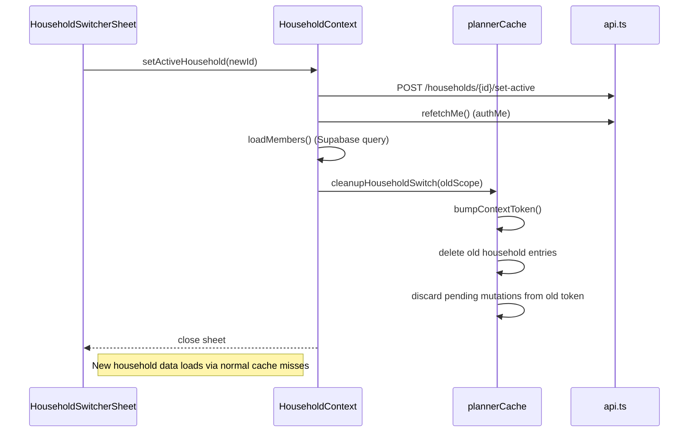
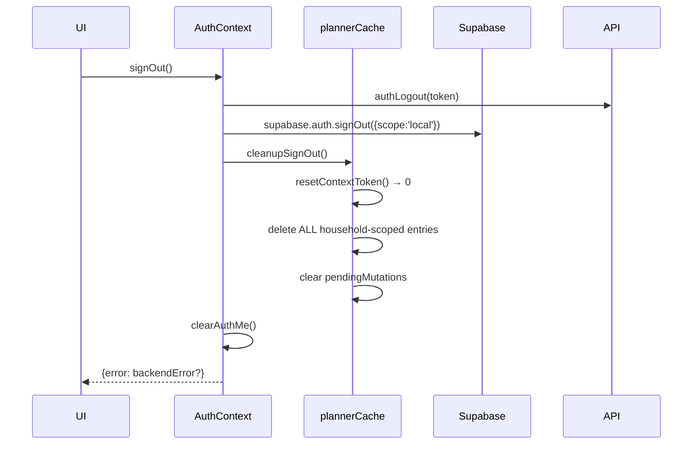
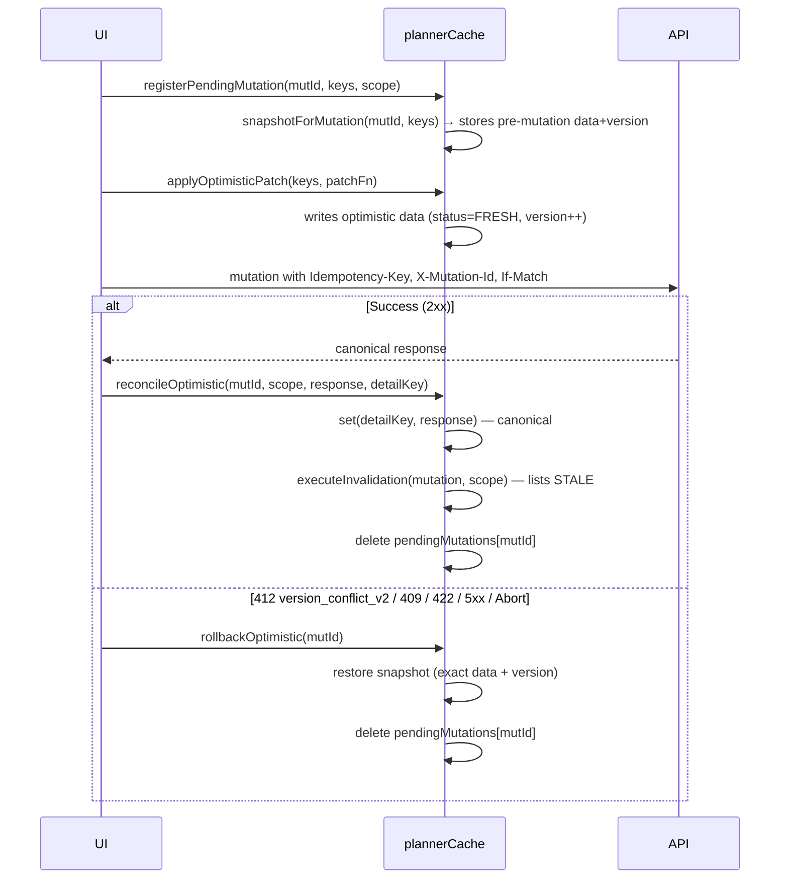

# PLANNER V0 — CACHE & QUERY KEYS CONTRACT

> Frozen G0.3 contract for Planner server-state infrastructure.
> This document is the canonical reference for query keys, cache policies,
> invalidation rules, and optimistic-update protocol until a follow-up version
> explicitly amends it.

---

## 1. Query-Key Factory: `plannerKeys`

**File**: `front/mi-front-limpio/services/planner/plannerKeys.ts`

Single public source of truth for **all** Planner query keys. Every key that
carries household-scoped data includes an explicit `HouseholdScope`
(`{ householdId }`). Capability keys include `CapabilityScope`
(`{ accountId, householdId, membershipId }`). No implicit household.

### 1.1 Key Taxonomy

| Kind | Factory | Shape | Scope |
|------|---------|-------|-------|
| **Root** | `plannerKeys.root()` | `['planner']` | — |
| **Capabilities** | `plannerKeys.capabilities(scope)` | `['planner','capabilities', accountId, householdId, membershipId]` | CapabilityScope |
| **Tasks — collection** | `plannerKeys.tasks.all(scope)` | `['planner','tasks', householdId, 'all']` | HouseholdScope |
| **Tasks — list** | `plannerKeys.tasks.list(scope, filters?)` | `['planner','tasks', householdId, 'list', ...filtersKey]` | HouseholdScope |
| **Tasks — detail** | `plannerKeys.tasks.detail(scope, taskId)` | `['planner','tasks', householdId, 'detail', taskId]` | HouseholdScope |
| **Events — collection** | `plannerKeys.events.all(scope)` | `['planner','events', householdId, 'all']` | HouseholdScope |
| **Events — list** | `plannerKeys.events.list(scope, filters?)` | `['planner','events', householdId, 'list', ...filtersKey]` | HouseholdScope |
| **Events — detail** | `plannerKeys.events.detail(scope, eventId)` | `['planner','events', householdId, 'detail', eventId]` | HouseholdScope |
| **Goals — collection** | `plannerKeys.goals.all(scope)` | `['planner','goals', householdId, 'all']` | HouseholdScope |
| **Goals — list** | `plannerKeys.goals.list(scope, filters?)` | `['planner','goals', householdId, 'list', ...filtersKey]` | HouseholdScope |
| **Goals — detail** | `plannerKeys.goals.detail(scope, goalId)` | `['planner','goals', householdId, 'detail', goalId]` | HouseholdScope |
| **Goals — milestones** | `plannerKeys.goals.milestones(scope, goalId)` | `['planner','goals', householdId, 'milestones', goalId]` | HouseholdScope |
| **Summary** | `plannerKeys.summary(scope)` | `['planner','summary', householdId]` | HouseholdScope |
| **Trash** | `plannerKeys.trash(scope, type?)` | `['planner','trash', householdId, type?]` | HouseholdScope |
| **Calendar** | `plannerKeys.calendar(scope, view?, date?)` | `['planner','calendar', householdId, view?, date?]` | HouseholdScope |
| **Search (reserved)** | `plannerKeys.search(scope, query, filters?)` | `['planner','search', householdId, query, ...filtersKey]` | HouseholdScope |

### 1.2 Filter Normalization

`filtersKey` is produced by `normalizeFilters(filters)`:
- Drops `undefined`, `null`, `''` (empty string)
- Preserves `false`, `0`
- Sorts keys alphabetically
- Returns flat array: `[key1, value1, key2, value2, ...]`
- Booleans serialized as `'true' | 'false'`

**Result**: Two filter objects with the same semantic filters produce the **exact same key array** (referential equality not required — `JSON.stringify` equality holds).

### 1.3 Key Classification Helpers

```ts
classifyKey(key): 'tasks' | 'events' | 'goals' | 'summary' | 'trash' | 'calendar' | 'capabilities' | 'search' | null
householdOf(key): string | null  // extracts householdId or null
```

Used by cache for TTL routing and invalidation prefix matching.

---

## 2. Cache Policy

**File**: `front/mi-front-limpio/services/planner/plannerCache.ts`

### 2.1 Entry State Machine

```
                ┌──────────────┐
                │   PENDING    │  (fetch in flight)
                └──────┬───────┘
                       │ success
                       ▼
               ┌──────────────┐     staleAt < now     ┌────────┐
               │    FRESH     │ ────────────────────▶ │ STALE  │
               └──────┬───────┘                       └────────┘
                      │ error                              ▲
                      ▼                                    │
               ┌──────────────┐                            │
               │    ERROR     │                            │
               └──────────────┘                            │
                      ▲                                    │
                      │ invalidate() / bumpContextToken()  │
                      └────────────────────────────────────┘
```

- `FRESH`: `status === 'fresh' && staleAt > now() && contextToken === current`
- `STALE`: `status === 'stale'` OR `staleAt <= now()` OR `contextToken !== current`
- `PENDING`: `status === 'pending'` (dedupes concurrent fetches)
- `ERROR`: `status === 'error'` (terminal unless retried)

### 2.2 Stale TTL (ms) — configurable via `plannerCache.setStaleConfig()`

| Kind | Default | Rationale |
|------|---------|-----------|
| `tasks` | 30,000 | High user interaction, frequent mutations |
| `events` | 30,000 | Same |
| `goals` | 60,000 | Lower mutation frequency |
| `summary` | 15,000 | Home screen needs freshness |
| `trash` | 60,000 | Low frequency |
| `calendar` | 30,000 | View changes trigger refetch anyway |
| `capabilities` | 300,000 | Rarely changes; role/membership gated |
| `search` | 10,000 | Reserved; low TTL when implemented |

### 2.3 Refetch Triggers

| Trigger | Behavior |
|---------|----------|
| **Focus/mount** | Consumer calls `fetch` → cache returns stale data immediately, kicks off background refresh if `STALE` |
| **Reconnect** | Same as focus |
| **Mutation success** | `executeInvalidation` marks affected keys `STALE`; next read triggers refresh |
| **Explicit `invalidate(key)`** | Marks single key `STALE` |
| **Context token bump** | All old-household entries logically `STALE` (contextToken mismatch) |

### 2.4 Retries

| Operation | Retries |
|-----------|---------|
| GET (queries) | **None** — caller decides via focus/mount |
| Mutations | **None** — idempotency key + mutation ID provide server-side dedup; caller may retry with same keys |

### 2.5 HTTP Status Handling

| Status | Cache Effect |
|--------|--------------|
| 200/201 | `set(key, data)` → `FRESH` |
| 401 | `setError(key, AuthError)`; session cleared by auth layer |
| 403 | `setError(key, ForbiddenError)`; deny-safe (no data) |
| 409/412 (`version_conflict_v2`) | Optimistic rollback via `rollbackOptimistic(mutationId)`; detail key stays at pre-mutation version |
| 422 | `setError(key, ValidationError)`; no rollback (optimistic not applied for validation) |
| 429 | `setError(key, RateLimitError)`; caller may retry after `Retry-After` |
| 5xx | `setError(key, ServerError)`; caller may retry |
| Offline / Abort | No cache write; `AbortError` thrown (not cached) |

### 2.6 Garbage Collection

- **Household switch**: `cleanupHouseholdSwitch(oldScope)` hard-deletes all entries with `contextToken !== current` AND `householdOf(key) === oldScope.householdId`.
- **Sign-out**: `cleanupSignOut()` deletes **all** household-scoped entries, resets context token to 0, clears pending mutations.
- **Memory bound**: No automatic LRU — TTL + explicit cleans bound total entries.

### 2.7 Persistence

**NO persistence to AsyncStorage / disk during G0.3**.
- All cache is in-memory (`Map`).
- Survives navigation, dies on unmount / sign-out / household switch.
- V1 may persist `lastTab` per `accountId:householdId` via `plannerPreferences.ts` (separate, non-server-state).

---

## 3. Cancelable Requests

**File**: `front/mi-front-limpio/services/api.ts` → `requestJson`

```ts
type RequestJsonOptions = {
  // ...existing...
  signal?: AbortSignal | null;      // external abort (household switch, unmount)
  timeoutMs?: number;               // auto-abort after ms
};
```

- External `signal` + `timeoutMs` merged into a single `AbortController`.
- `AbortError` (subclass of `Error`, `name === 'AbortError'`) thrown on abort.
- **Consumers MUST discriminate `AbortError` and suppress error UI**.
- `timeoutMs` fires `controller.abort()`; timer cleaned on settle.

---

## 4. Context Token & Late-Response Protection

### 4.1 Mechanism

- `contextToken: number` starts at `0`.
- `bumpContextToken()` called on **every household switch** (returns new token).
- `resetContextToken()` called on **sign-out** (sets to `0`).
- Every cache entry stores `contextToken` at write time.
- `get(key)` / `getEntry(key)` return `null` if `entry.contextToken !== currentToken`.
- `isCurrentContext(entry)` helper for manual checks.

### 4.2 Late-Response Scenario

```
T0: User in Household A (token=0). Fetch tasks → pending.
T1: User switches to Household B → bumpContextToken() → token=1.
    cleanupHouseholdSwitch(A) → hard-deletes A's entries.
T2: Household A's fetch resolves.
    Cache write would have token=0, but current token=1.
    Entry is logically invalid; get() returns null.
```

**Guarantee**: A response from household A can never overwrite household B's UI.

---

## 5. Directed Invalidation Graph

**File**: `plannerCache.getInvalidationKeys(mutation, scope)` → `readonly unknown[][]`

Centralized mutation → affected-keys mapping. **No global `refetchAll`**.

### 5.1 Graph

| Mutation | Keys Invalidated |
|----------|------------------|
| `task.create / update / complete / cancel / verify / reactivate` | task detail, **all task lists** (prefix), `summary` |
| `task.trash / restore` | task detail, **all task lists**, `trash`, `summary` |
| `event.create / update / cancel / reactivate` | event detail, **all event lists**, `summary` |
| `event.trash / restore` | event detail, **all event lists**, `trash`, `summary` |
| `event.override` | **all event lists**, `calendar`, `summary` |
| `goal.create / update / complete / close / reopen / fail` | goal detail, **all goal lists**, `summary` |
| `goal.trash / restore` | goal detail, **all goal lists**, `trash`, `summary` |
| `milestone.*` | goal milestones, goal detail, **all goal lists**, `summary` |
| `capabilities` | capability key for membership |

**List invalidation uses prefix**: `invalidatePrefix(['planner','tasks', householdId])` catches `all`, `list+filters`, `detail`.

### 5.2 Exceptions

- `trash` mutations also invalidate `trash` list.
- `calendar` invalidated on event override (affects occurrences).
- `summary` invalidated on **any** task/event/goal mutation that affects counts.

---

## 6. Household Switch Lifecycle

**File**: `front/mi-front-limpio/context/HouseholdContext.tsx` (effect on `currentHousehold.id`)



**Protocol guarantees**:
1. Block new mutations from old context (context token bump).
2. Cancel in-flight requests via `AbortSignal` (wired in V1 hooks).
3. Invalidate context token → logical discard of old responses.
4. Hard-delete old household cache entries.
5. Load new household capabilities + minimal data.
6. Allow interaction.

---

## 7. Sign-Out Cleanup

**File**: `front/mi-front-limpio/context/AuthContext.tsx` → `signOut()`



- **Idempotent**: safe to call multiple times.
- **Non-sensitive prefs preserved** (none yet; V1 `plannerPreferences` separate).

---

## 8. Optimistic Update + Rollback

### 8.1 Protocol



### 8.2 412 `version_conflict_v2` Handling

- **Rollback** to exact pre-mutation snapshot (data + version).
- **Do NOT** silently retry with new version.
- **Do NOT** last-write-wins.
- UI shows conflict modal with `error.details.current` (server version) and `error.details.expected` (client version).
- User re-fetches, re-applies intent.

### 8.3 Same MutationId Double-Patch Guard

- Caller must check `isMutationCurrent(mutationId)` before re-applying optimistic patch on retry.
- Cache does **not** auto-dedup; mutationId stability is caller responsibility.

---

## 9. Capabilities as Server State

**File**: `front/mi-front-limpio/services/plannerCapabilities.ts` → `fetchPlannerCapabilitiesCached`

- Key: `plannerKeys.capabilities({ accountId, householdId, membershipId })`
- TTL: 5 min (`capabilities` kind)
- Context token protected.
- Household switch → `invalidateCapabilities(scope)` + `cleanupHouseholdSwitch` discards old.
- Sign-out → `cleanupSignOut` clears.
- **Frontend never derives permissions from role** — only uses projection for UX (disable/hide). Backend re-verifies.

---

## 10. Testing Contract

Minimal reproducible tests covering:

| Area | Verification |
|------|--------------|
| Query keys | Different households → different keys; equivalent filters → same key; no household-scoped key omits household |
| Invalidation | Task mutation → task lists + summary stale; event/goal lists fresh |
| Cancellation | Household switch bumps context token; old entries inaccessible |
| Late response | Old token entries return `null` on `get()` |
| Optimistic | Snapshot → patch → reconcile (version++) → rollback exact (data+version) |
| Cleanup | Sign-out clears all; idempotent; household B never sees A's data |

Run: `npx ts-node scripts/planner_g0_3_cache_tests.ts` (or compiled JS).

---

## 11. Versioning

This contract is **frozen for G0.3**. Changes require a new G0.x or V1 gate.

## 12. Post-G0.3.1 architecture update

El contrato de keys, scopes, TTLs e invalidaciones concretas continúa siendo Planner. El storage y optimistic lifecycle genéricos ahora se delegan a `services/core/serverState.ts`; `plannerCache.ts` traduce la política Planner al Core.

Prefix invalidation compara segmentos del array y todo request cacheable captura generation y usa `setForContext`, por lo que una respuesta A no puede escribir después de activar B. El comando reproducible vigente es `npm.cmd run test:g0.3` desde el root.
