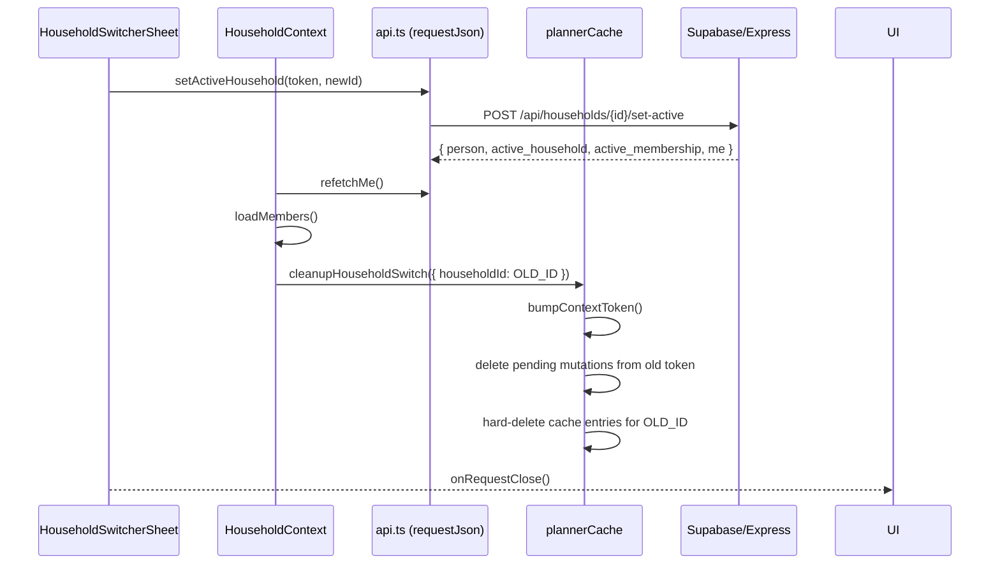
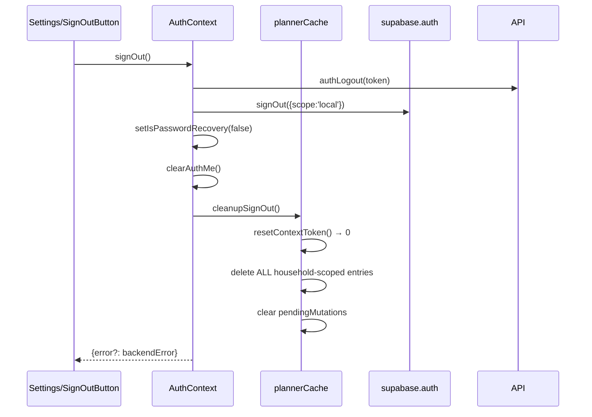

# PLANNER V0 — HOUSEHOLD CONTEXT LIFECYCLE

> G0.3 contract for household switch and sign-out lifecycle.
> This document specifies the **exact sequence** of operations when the active
> household changes or the user signs out, ensuring zero cross-household data
> leakage and no stale responses corrupting the new context.

---

## 1. Household Switch

### 1.1 Trigger

User taps a different household in `HouseholdSwitcherSheet` →
`handleSwitchHousehold(newHouseholdId)` fires.

### 1.2 Sequence (Implemented)



### 1.3 `cleanupHouseholdSwitch(oldScope)` Details

```ts
function cleanupHouseholdSwitch(oldScope: HouseholdScope): number {
  // 1. Bump context token — all old-household entries now invalid
  const newToken = bumpContextToken(); // returns new token (1, 2, ...)

  // 2. Discard pending mutations from old context
  let mutationCount = 0;
  for (const [mutId, pending] of pendingMutations.entries()) {
    if (pending.contextToken !== newToken) {
      pendingMutations.delete(mutId);
      mutationCount++;
    }
  }

  // 3. Hard-delete old household cache entries (memory pressure)
  let cacheCount = 0;
  for (const [keyStr, entry] of cache.entries()) {
    if (entry.contextToken !== newToken) {
      const hh = householdOf(entry.key);
      if (hh === oldScope.householdId) {
        cache.delete(keyStr);
        cacheCount++;
      }
    }
  }

  return cacheCount + mutationCount;
}
```

### 1.4 Guarantees

| Guarantee | Mechanism |
|-----------|-----------|
| **No A data in B UI** | Context token bumped → `get(key)` returns `null` for old entries |
| **No A capabilities in B** | Capability key includes `membershipId`; old entry token mismatch + hard-delete |
| **No optimistic patches from A** | `registerPendingMutation` stores `contextToken`; `cleanupHouseholdSwitch` discards them |
| **No in-flight A requests corrupt B** | V1 hooks will pass `signal` from cache; `cleanupHouseholdSwitch` does NOT abort directly — the signal is owned by the caller. G0.3 provides the token; V1 connects the signal. |
| **Rollback on activation failure** | If `setActiveHousehold` throws, `cleanupHouseholdSwitch` NOT called; token unchanged; old household remains active |

### 1.5 Extensibility for V1 (`PlannerSheetHost`)

G0.3 does **not** implement `PlannerSheetHost` (V1 M3). However, the lifecycle
exposes hooks V1 will consume:

```ts
// In PlannerSheetHost (V1 M3):
const onHouseholdSwitch = (oldScope: HouseholdScope) => {
  // 1. Close any open sheet (task/event/goal form)
  closeSheet('user_switched_household');

  // 2. Cancel in-flight form submissions
  abortController.abort(); // tied to mutation signal

  // 3. Discard any draft state
  draftRef.current = null;

  // 4. G0.3 already ran cleanupHouseholdSwitch via HouseholdContext effect
};
```

The `HouseholdContext` effect runs **after** `refetchMe()` and `loadMembers()`
complete, so the new `currentHousehold` is already set when cleanup runs.

---

## 2. Sign-Out Cleanup

### 2.1 Trigger

User taps "Cerrar sesión" → `AuthContext.signOut()` fires.

### 2.2 Sequence (Implemented)



### 2.3 `cleanupSignOut()` Details

```ts
function cleanupSignOut(): void {
  resetContextToken();           // token = 0
  pendingMutations.clear();      // all pending mutations discarded

  // Delete all household-scoped entries (keep root only)
  for (const [keyStr, entry] of cache.entries()) {
    if (householdOf(entry.key)) {
      cache.delete(keyStr);
    }
  }
}
```

### 2.4 Guarantees

| Guarantee | Mechanism |
|-----------|-----------|
| **No planner data after sign-out** | All household-scoped cache entries hard-deleted |
| **No pending mutations replay** | `pendingMutations.clear()` |
| **No capabilities leak** | Capability keys are household-scoped → deleted |
| **Idempotent** | Safe to call multiple times; `resetContextToken()` sets to 0; `clear()` on empty Map is no-op |
| **Non-sensitive prefs preserved** | `plannerPreferences` (V1) is separate; not touched |

---

## 3. Late-Response Protection (Context Token)

### 3.1 Mechanism

- `contextToken` starts at `0`.
- **Every** household switch → `bumpContextToken()` (monotonic increment).
- **Sign-out** → `resetContextToken()` (→ `0`).
- Every cache entry stores `contextToken` at write time.
- `get(key)` / `getEntry(key)` return `null` if `entry.contextToken !== currentToken`.

### 3.2 Scenario: Stale Response After Switch

```
T0: User in Household A (token=0). Query tasks → pending.
T1: User switches to Household B.
    → cleanupHouseholdSwitch(A) → token=1, A's entries deleted.
T2: Household A's fetch resolves.
    → Cache write would have token=0.
    → UI calls get(tasksKey) → returns null (token mismatch).
    → Household B's UI never sees A's data.
```

### 3.3 Pending Mutations from Old Context

- `registerPendingMutation(mutId, keys, scope)` stores `contextToken` at mutation start.
- `cleanupHouseholdSwitch` discards all pending mutations where `pending.contextToken !== newToken`.
- `isMutationCurrent(mutId)` returns `false` for old-context mutations.
- V1 optimistic retry logic must check `isMutationCurrent` before re-applying patch.

---

## 4. Integration Points

### 4.1 `HouseholdContext` (G0.3)

```tsx
// HouseholdContext.tsx
const prevHouseholdIdRef = useRef<string | null>(currentHousehold?.id ?? null);
useEffect(() => {
  const newId = currentHousehold?.id ?? null;
  const oldId = prevHouseholdIdRef.current;
  if (oldId && newId && oldId !== newId) {
    plannerCache.cleanupHouseholdSwitch({ householdId: oldId });
  }
  prevHouseholdIdRef.current = newId;
}, [currentHousehold?.id]);
```

### 4.2 `AuthContext` (G0.3)

```tsx
// AuthContext.tsx
const signOut = useCallback(async () => {
  // ... existing authLogout + supabase.signOut ...
  plannerCache.cleanupSignOut();
  // ...
}, [clearAuthMe, session?.access_token]);
```

### 4.3 `api.ts` (G0.3 — cancelable transport)

```ts
// requestJson options
signal?: AbortSignal | null;      // caller provides
timeoutMs?: number;               // caller provides

// Internal: merges external signal + timeout into one AbortController
// Throws AbortError on abort (caller must suppress)
```

### 4.4 V1 Hooks (Future — M3+)

```tsx
// usePlannerQuery.ts (V1)
function usePlannerQuery(key, fetcher, scope) {
  const abortRef = useRef<AbortController>();
  const { currentHousehold } = useHousehold();

  useEffect(() => {
    abortRef.current = new AbortController();
    const signal = abortRef.current.signal;

    fetcher({ signal }) // passes signal to requestJson
      .then(data => cache.set(key, data))
      .catch(e => { if (!(e instanceof AbortError)) cache.setError(key, e); });

    return () => abortRef.current?.abort(); // cancel on unmount / household change
  }, [scope.householdId]); // re-fetch on household change
}
```

---

## 5. Test Verification (G0.3 Tests)

| Test | Assertion |
|------|-----------|
| `cleanupHouseholdSwitch` purges old household | `plannerCache.get(oldKey) === null` after switch |
| `cleanupHouseholdSwitch` bumps token | `plannerCache.getContextToken() === 1` |
| `cleanupHouseholdSwitch` discards old pending mutations | `getPendingMutations()` excludes old `mutId` |
| `cleanupSignOut` clears all | `getContextToken() === 0`, `getPendingMutations().length === 0`, all keys `null` |
| `cleanupSignOut` idempotent | Second call keeps token=0, mutations empty |
| Late response discarded | `get(key)` returns `null` for old-token entry |

---

## 6. Versioning

This lifecycle contract is **frozen for G0.3**. Changes require a new G0.x or V1 gate.

---

## 7. Related Documents

- `PLANNER_V0_G0_3_SERVER_STATE_CONTEXT_REPORT.md` — full implementation report
- `PLANNER_V0_CACHE_QUERY_KEYS_CONTRACT.md` — query keys, cache policy, invalidation
- `planner_v1_implementation_order.md` — V1 micro-phases (M3 `PlannerSheetHost`, M6 `plannerPreferences`, etc.)